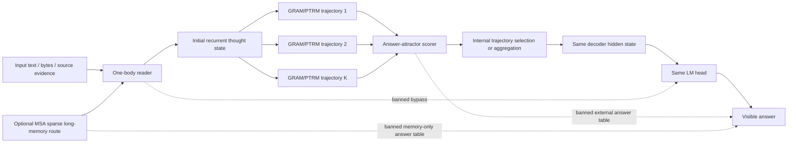

# Internal Multi-Trajectory Answer Attractor SSOT

Date: 2026-05-25

Status: active paper-candidate architecture contract.

If this file conflicts with older GRAM/PTRM/top-k/selector notes, this file
wins for publishable architecture claims.

## Name

Working paper name:

```text
Internal Multi-Trajectory Answer Attractor
```

Short local name:

```text
IMTA
```

Allowed longer description:

```text
one-body GRAM/PTRM answer-attractor reasoning
```

Avoid claiming novelty with only these names:

```text
top-k candidates
top-3 verifier
GRAM + PTRM
candidate selector
```

Those are ingredients, not the paper contribution.

## Plain-Language Thesis

The model should not be a committee where one part writes possible answers,
another detached part checks them, and a final speaker guesses how to say the
selected result.

The target is one learned student:

```text
read the problem
-> form several internal solution attempts
-> check which attempt is settling toward a valid answer
-> speak through the same answer path
```

The publishable idea is not "make top-k candidates."  It is:

```text
multiple internal reasoning trajectories compete inside one body,
and the normal LM head is pulled toward the stable answer basin.
```

## One-Sentence Intuition

Top-k is just trying several guesses; IMTA is trying several internal lines of
thought and letting the one that forms the strongest answer attractor control
the same mouth.

## Prior-Work Boundary

These parts are not novel by themselves:

| ingredient | prior-work overlap | consequence |
| --- | --- | --- |
| Multiple sampled reasoning paths | Self-Consistency and Tree of Thoughts | Do not sell top-k alone as novelty. |
| Stochastic recursive latent trajectories | GRAM | Do not claim stochastic recursive reasoning as ours. |
| Gaussian/noisy TRM breadth with Q-head selection | PTRM | Do not claim noise-plus-selector as ours. |
| Fixed-point / attractor reasoning | EqR and Attractor Models | Do not claim attractors alone as ours. |
| One-body recurrent text LM | HRM-Text | Do not claim read-think-speak recurrence alone as ours. |
| PrefixLM Data-IO training contract | HRM-Text data_io / PrefixLM | Do not claim HRM-Text-like training from synthetic forced-choice probes alone. |
| Generalization mode-hopping probes | Generalization Dynamics of LM Pre-training | Do not trust final loss or sparse checkpoints alone. |
| Dynamic pretraining data selection | OPUS-style per-iteration data selection | Do not claim data-curriculum novelty without optimizer-aware data-selection ablations. |
| Architecture/optimizer/memory as nested learning | Nested Learning / Hope | Do not claim self-modifying or continuum-memory learning unless implemented and ablated. |
| End-to-end sparse long memory | MSA / Memory Sparse Attention | Do not claim long-memory reasoning unless memory routing is causally used and ablated. |

Useful sources:

- Self-Consistency: <https://arxiv.org/abs/2203.11171>
- Tree of Thoughts: <https://arxiv.org/abs/2305.10601>
- GRAM / Generative Recursive Reasoning: <https://arxiv.org/abs/2605.19376>
- PTRM / Probabilistic Tiny Recursive Model: <https://arxiv.org/abs/2605.19943>
- HRM-Text: <https://arxiv.org/abs/2605.20613>
- EqR / Equilibrium Reasoners: <https://arxiv.org/abs/2605.21488>
- Attractor Models: <https://arxiv.org/abs/2605.12466>
- HRM-Text repo: <https://github.com/sapientinc/HRM-Text>
- Generalization Dynamics: <https://jiaxin-wen.github.io/blog/generalization-dynamics>
- OPUS data selection: <https://arxiv.org/abs/2602.05400>
- Nested Learning: <https://arxiv.org/abs/2512.24695>
- MSA / Memory Sparse Attention: <https://arxiv.org/abs/2603.23516>

## How These Three Papers Are Used

These papers and reference systems are not all used in the same way.

Plain-language split:

```text
Generalization Dynamics:
  the dashboard.
  It tells us that a model can suddenly switch between shallow parroting and
  real generalization, so one smooth loss curve is not enough evidence.

HRM-Text DataIO:
  the schoolbook and exam format.
  It fixes the one-body language contract: condition/instruction/response rows
  become PrefixLM input_ids, labels, and attention_mask, with loss only on the
  response tokens that the same LM head must speak.

OPUS:
  the food selector.
  It suggests selecting training examples by how they change the actual
  optimizer-induced update, not by a static dataset recipe. In code, this now
  means a candidate row must audition against a heldout proxy gradient before
  it gets into an OPUS-selected byte window.

Nested Learning:
  the design lens.
  It says architecture, optimizer, memory, and update frequency should be
  treated as one nested learning system rather than unrelated parts.

MSA:
  the long-memory shelf.
  It gives the reader a trainable sparse route into very large memory, instead
  of stuffing everything into the prompt or relying on detached RAG.
```

Current IMTA usage status:

| paper | current use | not yet implemented |
| --- | --- | --- |
| Generalization Dynamics | Already used as an evaluation philosophy: Stage101 probes compare parrot-like answers against intelligence-like answers, log margins, and preserve old anchors across later training. | Full checkpoint-sweep mode-hopping monitor across long pretraining runs. |
| HRM-Text DataIO | Already implemented locally as the native PrefixLM DataIO contract in `scripts/534_train_native_prefixlm_dataio.py` and tested by `tests/test_hrm_text_prefixlm_dataio_trainer.py`. | A full paper-grade HRM-Text-scale data parity run and sealed same-contract baseline comparison. |
| OPUS | `scripts/614_score_opus_projected_utility.py` implements the first real scorer: proxy gradient, candidate gradient, AdamW-state preconditioning when available, CountSketch projection, redundancy-adjusted utility, and Stage95 utility-window binding. Stage95 uses static partial reading to create `last.pt`, then uses that optimizer-bearing checkpoint to select the full window when `FULL_SELECTION_MODE=utility`. | Full every-iteration online buffer selection inside the trainer. |
| Nested Learning | Used as the architectural lens for IMTA: reader, recurrent thought, checker, curiosity brake, and memory should behave like nested learning processes with different update roles. | Hope-style self-modifying modules, continuum memory, or deep optimizer replacement. |
| MSA | Used as the long-memory scaling reference: a future IMTA reader may receive evidence through MSA-style sparse memory routing. | Full-MSA donor healing, Memory Parallel runtime, memory-off/router-off/chunk-shuffle ablations in the IMTA path. |

Required interpretation:

```text
We are not claiming that IMTA already implements full every-iteration OPUS or
Hope.
We are not claiming that current Stage101 results prove MSA.
We are claiming that IMTA should be tested and extended through this stack:
  Generalization Dynamics for monitoring,
  HRM-Text DataIO for the one-body language training contract,
  OPUS-like selection for data windows,
  Nested Learning for future memory/update-frequency design,
  MSA for future sparse long-memory routing into the reader.
```

The practical consequence:

```text
Never promote a run because train loss is lower.
Promote only when:
  parrot-vs-intelligence margins improve,
  PrefixLM heldout loss and free generation do not regress,
  old anchors stay accepted,
  shallow shortcut rows do not reappear,
  evidence/curiosity rows do not collapse into ask-everything or answer-everything,
  and the result survives heldout rows.
```

## Actual Novelty Candidate

The local paper candidate is the composition under a stricter causal contract:

```text
stochastic recurrent breadth
+ answer-facing attractor convergence
+ same-body LM-token answer path
+ verifier/selection signal that cannot bypass the thinker
+ ablations proving the gain disappears when each part is removed
```

Plain-language novelty:

```text
The model does not merely choose from external answer cards.
It learns internal candidate thoughts, checks their stability, and speaks from
the winning thought through the same mouth.
```

Technical novelty candidate:

```text
reader state x
-> K stochastic recurrent trajectories z_1..z_K
-> per-trajectory attractor metrics:
     answer margin,
     residual/fixed-point stability,
     verifier or Q score,
     optional evidence sufficiency / curiosity brake
-> differentiable or training-supervised selection / aggregation
-> same decoder hidden state
-> same LM head answer
```

The selection signal is allowed only if it selects among internal thought
states that causally feed the normal answer head.  It must not select from a
handmade answer table.

## Canonical Diagram



## What Counts As One Body

Accepted:

```text
input -> recurrent thought trajectories -> selected/aggregated thought state
-> normal decoder hidden -> normal LM head -> answer
```

Rejected:

```text
input -> heuristic candidate answers -> external verifier -> final chosen text
```

Rejected:

```text
input -> typed trace or register is correct
but final LM head can answer equally well when that trace/register is disabled
```

Rejected:

```text
selected/oracle metric improves
but normal generation, same-head forced choice, or answer-margin gate does not
```

## Role Split

Use these roles in implementation and papers:

```text
reader:
  converts input/context/evidence into the state needed for thought.

candidate thinker:
  produces K stochastic recurrent trajectories, GRAM/PTRM-style.

checker:
  scores whether a trajectory is converging toward a correct answer basin.

speaker:
  emits tokens from the selected/aggregated thought state through the same LM
  head.

curiosity brake:
  optional metacognitive gate that says whether enough evidence exists to
  answer, instead of blindly answering or blindly asking.

MSA memory router:
  optional long-memory path that brings sparse evidence into the reader.  It is
  not the speaker and not the checker.  It only earns a claim when memory_off,
  router_off, and chunk_shuffle ablations hurt the same-head answer path.
```

Do not describe the checker as an external oracle unless the experiment is
explicitly diagnostic.

## Required Metrics

Every IMTA experiment must log:

```text
K=1, K=3, K=8 trajectory scaling
depth=1/2/4/8/16 scaling
per-trajectory answer margin
per-trajectory fixed-point residual or convergence residual
selected-vs-best-oracle split
same LM-head forced-choice accuracy
free generation samples
first-response-token top1/accuracy
EOS/special-token rate
repetition rate
teacher-forced target rank/top-k
parrot-vs-intelligence answer margin
anchor preservation after each data window
```

For HRM-Text/DataIO-style language runs, also log:

```text
dataset contract = hrm_text_data_io_prefixlm
condition/instruction/response row counts
response-token CE and accuracy
heldout PrefixLM loss
first-response-token top1/accuracy
free generation samples through the same LM head
special-token/EOS/repetition rates
same-contract HRM-Text baseline curve if making efficiency claims
```

For evidence/metacognition tasks, also log:

```text
answer_permission yes/no accuracy
missing_material accuracy
answer_now vs ask_more confusion
trusted+sufficient false-ask rate
insufficient false-answer rate
```

For MSA/long-memory tasks, also log:

```text
memory_on vs memory_off
router_on vs router_off
target document recall
chunk-shuffle sensitivity
distractor robustness
same LM-head answer gain from routed memory
```

## Required Ablations

Promotion requires all relevant ablations:

```text
GRAM/PTRM stochastic breadth off:
  K>1 gain should disappear or shrink.

trajectory selection/checker off:
  selected trajectory should no longer beat random/internal average.

answer-attractor loss/off:
  deeper thought should no longer improve answer margins.

one-body state off:
  final answer gain should disappear.

external candidate table off:
  no change should occur, because external tables are not allowed in promoted
  runs.

curiosity brake off:
  trusted+sufficient false-ask or insufficient false-answer should worsen on
  Stage101-style evidence gates.

MSA memory routing off:
  long-memory factual/evidence gains should disappear or shrink.

MSA chunk shuffle:
  if document-wise routing is causal, shuffling or replacing the target memory
  chunk should hurt the same-head answer path.
```

## Promotion Gate

An IMTA run can be promoted only if all are true:

```text
1. K scaling:
   K=3 or K=8 beats K=1 on heldout rows without oracle-only scoring.

2. Depth scaling:
   More recurrent thought improves or preserves answer-facing margin.

3. Same-mouth proof:
   The final normal LM head improves; side metrics alone do not count.

4. Ablation proof:
   stochastic breadth, checker/selection, answer-attractor, and one-body state
   each have a measurable causal contribution.

5. Old-anchor preservation:
   Stage101B answer-attractor anchor remains accepted.

6. Evidence brake:
   If evidence/metacognition is included, trusted+sufficient rows answer and
   insufficient rows ask or abstain correctly.

7. Free generation sanity:
   generated answers are non-degenerate and do not collapse into repetition,
   EOS loops, or special-token loops.

8. Memory causality, if MSA is included:
   memory_on beats memory_off, router_on beats router_off, and chunk_shuffle
   hurts target evidence tasks without replacing the same-mouth proof.
```

## Current Local Evidence

Supported local pieces:

```text
Stage101B:
  answer-attractor anchor is accepted and remains preserved after later
  evidence/curiosity experiments.

Stage101U:
  causal evidence-chain training improved heldout evidence judgment but did
  not pass.

Stage101V:
  evidence-seeking curiosity became learnable, but over-curiosity appeared.

Stage101W:
  curiosity-brake probe exists. First unbalanced W smoke improved heldout
  accuracy from 0.2 to 0.5 but rejected because it learned too much "no" and
  too much "none". W must stay balanced before another promotion claim.

Stage101W3:
  cause-card curriculum improved the evidence brake but did not solve it.
  Train depth16 accuracy moved from 0.4222 to 0.7111 and heldout depth16
  accuracy reached 0.7111, but accepted remains false because some rows still
  have large negative margins. The old Stage101B anchor remains accepted:
  depth16 accuracy 1.0, mean_margin 0.8721.

Stage101W4:
  causal-plausibility cause-card rows improved average train margin but were
  rejected. The failure means "more cause-card labels" is not enough.

Stage101W5:
  counterfactual minimal-repair rows asked for the smallest intervention
  needed to make an answer valid. Train moved, but heldout rejected:
  depth16 accuracy 0.5333, minimal_repair mean_margin -1.4134.

Stage101W6:
  counterfactual twins removed cause-card labels and showed two worlds side by
  side. Heldout rejected and got worse with depth: depth16 accuracy 0.375,
  mean_margin -0.7368.

Stage101W7:
  siamese counterfactual energy scored each world independently with the same
  yes/no answerability judge. This also rejected: W3 depth16 accuracy 0.375;
  W6-trained depth16 accuracy 0.375. The bottleneck is no longer the A/B output
  prompt alone. The reader does not yet reliably form source/relevance/detail/
  conflict features in latent state.

Stage101W8:
  latent feature-reader probes were added over decoder hidden state. W8A/B/C
  rejected, but gave a sharper diagnosis than W5-W7. With expanded balanced
  feature rows, class-weighted loss, and all-depth training, heldout depth16
  reached:
    source_reliability 0.8906
    evidence_relevance 0.7656
    detail_sufficiency 0.6875
    conflict_status 0.7969
    answer_permission 0.8750
  All-feature accuracy remained 0.3906 and min feature margin stayed negative.
  So the model can learn answer permission faster than it can decompose detail
  sufficiency and conflict as independent latent features.
```

Not yet proven:

```text
K trajectory scaling
GRAM/PTRM breadth causal ablation
same-body trajectory selection beating K=1
free-generation improvement
paper-grade general LM improvement
```

## Limitation Closure Matrix

This section is the guard against saying "solved" too early.

| limitation | current status | what is already fixed | remaining fix |
| --- | --- | --- | --- |
| Prior-work overlap | partially closed | This SSOT forbids novelty claims based only on top-k, GRAM, PTRM, selector, attractor, HRM-Text DataIO, mode-hopping monitors, OPUS-like data selection, or Nested Learning names. | Paper must compare against Self-Consistency/ToT, GRAM-only, PTRM-only, HRM-Text-style one-body, single-trajectory attractor baselines, and must cite HRM-Text DataIO / Generalization Dynamics / OPUS / Nested Learning as influences rather than local inventions. |
| Wrong-answer attractor | partly solved | Stage101B answer-attractor anchor remains accepted after W3: depth16 accuracy 1.0, mean_margin 0.8721. W3 improves evidence-brake heldout to 0.7111. | Evidence/curiosity still forms wrong basins. W4-W7 show that labels, repair words, twin prompts, and siamese scoring are not enough. W8 shows that answer permission becomes learnable before detail/conflict features are independently stable. |
| Detached checker risk | architecturally closed, empirically open | External answer tables and oracle-only selected metrics are banned as promoted paths. | Implement checker-off and one-body-state-off ablations in IMTA-K smoke. |
| K-scaling missing | open | Required metric is specified: K=1/3/8. | Run IMTA-K smoke and require K>1 to beat K=1 without oracle-only scoring. |
| Free generation gap | open | Required generation telemetry is specified. | Add free generation, first-token, EOS/special-token, repetition, and target-rank logs to every promoted run. |
| Toy/probe scope | open | Stage101 probes are explicitly marked local evidence, not paper-grade general LM evidence. | Extend to general language, factual evidence, multilingual, and agentic heldout suites after local gates pass. |
| Curiosity brake instability | open | W2 fixed label skew. W3 teaches source/relevance/detail/conflict cause cards and improves heldout accuracy to 0.7111 while preserving Stage101B. W4-W7 falsified four shallow variants. W8 added latent feature heads and found the remaining weak axes: detail sufficiency and conflict decomposition. | Next fix must train paired contrastive feature differences, not independent row labels: same claim/source with only detail or conflict changed, all-depth supervision, and feature-to-permission dependency. |
| Generalization mode-hopping | open | Required GD-style parrot-vs-intelligence margin logging is now part of the metric contract. | Run checkpoint/data-window sweeps; do not treat a single checkpoint as stable generalization proof. |
| HRM-Text DataIO parity | partially closed | Local PrefixLM DataIO trainer and tests exist; the contract maps DataIO rows to `input_ids`, response-only `labels`, and `attention_mask`. | Do not claim HRM-Text-scale or HRM-Text-efficiency superiority without a sealed same-contract HRM-Text baseline and generation gates. |
| Data selection | partially closed | OPUS-style data-window controller now exists: candidate rows are scored by projected optimizer utility, the default proxy includes language heldout plus GD-lite anti-parrot rows, and Stage95 can bind an OPUS-selected full sample from partial `last.pt`. | Full every-iteration online OPUS buffer selection inside the trainer. |
| Nested learning integration | open | Nested Learning is adopted as a design lens for multi-timescale reader/thought/checker/memory roles. | Do not claim Hope/self-modifying/continuum-memory implementation until those modules exist and are ablated. |
| MSA long-memory integration | open | MSA is now part of the paper context as the future sparse long-memory route into the IMTA reader. | Do not add MSA to rescue short-context W failures. Add it only after W/IMTA-K gates, then require memory_off/router_off/chunk_shuffle ablations. |
| Compute cost | open | K/depth scaling is mandatory to measure the cost. | Report accuracy or margin per unit compute for K/depth choices; do not promote K=8 if K=3 gives the same gain. |
| Reproducibility seal | open | Required artifacts are listed. | Seal exact command, checkpoint, materialized eval rows, seed, ablations, and generated samples before paper claims. |

Plain-language read:

```text
The old answer-attractor student can keep the right answer on shortcut traps.
The evidence student still sometimes treats "enough to answer" as a surface
habit instead of reading the source/relevance/conflict cause.

W3 showed that cause cards help, but W4-W7 showed that naming, repairing, or
comparing surface labels is not enough.  The next fix is not another prompt
variant.  It is a latent reader change:
  read the evidence
  bind source/relevance/detail/conflict as separate internal features
  compare counterfactual worlds through those features
  allow answer permission only after the feature state is coherent
```

Do not mark the wrong-attractor limitation closed until both are true:

```text
Stage101B anchor accepted
Stage101W-style evidence/curiosity brake accepted
```

## Next Experiment Contract

The next IMTA-aligned experiment should be small and falsifiable:

```text
Stage101W9 paired latent feature-difference reader
  stop training independent one-world feature labels as the main mechanism
  build paired rows where the same claim/source changes exactly one feature:
    enough detail vs missing detail
    clear evidence vs conflicting evidence
    relevant evidence vs irrelevant evidence
    trusted source vs untrusted source
  train all depths for every pair
  use pairwise feature-margin loss over pooled hidden states
  force answer permission to follow the pairwise feature difference
  train from W3 or W8C as a diagnostic branch, but do not promote W8C
  evaluate:
    W8 heldout
    W3/W5/W6 heldout if time allows
    U/R heldout if time allows
    Stage101B anchor
  reject if detail/conflict pairwise margins stay negative
  reject if feature probes pass but answer permission still rejects
  reject if Stage101B anchor regresses
  reject if depth improves answer permission while feature decomposition worsens
```

W9 is the last nearby diagnostic in this rejected family, not an endless tuning
branch.  If it does not quickly make detail/conflict pair margins positive, the
next move must be a real route change:

```text
Stage101X counterfactual-imagination answer attractor
  builder:
    scripts/600_build_stage101x_counterfactual_answer_attractor_probe.py
  trainer:
    scripts/601_train_stage101x_counterfactual_answer_attractor.py
  tests:
    tests/test_stage101x_counterfactual_answer_attractor_probe.py
    tests/test_stage101x_counterfactual_answer_attractor_train.py

  local minimum to escape:
    independent labels, feature heads, repair prompts, and pairwise margins can
    teach the model to name evidence states without making the normal answer
    path use them.

  preserved successful behavior:
    Stage101B answer-attractor keeps shortcut answers stable;
    W3/W8 show the model can partially learn answer permission.

  causal route that changes:
    no detached feature reader as the promoted path.
    run the same one-body model on:
      original world
      minimally imagined counterfactual world
    and train the same LM-head answer margin to stay/fall/flip according to the
    counterfactual.

  plain-language idea:
    the model should not only read "is this enough?"
    it should mentally ask "what small change would make this answer invalid?"
    and then compare the two worlds before speaking.

  fast falsification gate:
    on paired worlds, original answer margin and imagined-counterfactual margin
    must separate through the same LM head at depth 8/16;
    if the feature probe improves but LM-head answer separation does not, reject.
```

## Latest-Literature Pivot After Strong Source-Binding Rejects

Stage101X/Y/Z produce a strong source-binding rejection signal.  The model can
learn content-level counterfactual separation better than W9, but it still does
not treat source identity as a stable variable that the normal LM-head answer
path must dereference.

Do not keep tuning provenance prompts or pairwise losses.  Before another
source-reliability run, use the following paper-backed read:

```text
MemLineage, 2605.14421:
  provenance should be a chain-of-custody/lineage object, not a text filter.
  QTRM implication:
    source trust must live in a structured lineage register with derivation
    edges, then gate answer authority.

How Do Transformers Learn Variable Binding in Symbolic Programs, 2505.20896:
  variable binding emerges when the residual stream becomes addressable memory
  and attention routes values across token positions.
  QTRM implication:
    S1/S2 should not be mere words.  The model needs an addressable source-id
    -> trust-value binding path.

PaperTrail, 2602.21045:
  claim/evidence provenance must be decomposed into discrete supported,
  unsupported, and omitted assertions.
  QTRM implication:
    evidence rows need claim nodes, evidence nodes, and support edges, not just
    prose prompts.

The Provenance Paradox in Multi-Agent LLM Routing, 2603.18043:
  self-claimed quality is not enough; identity must be attested.
  QTRM implication:
    source reliability must be attested externally/structurally, then injected
    as authority, not inferred from text style.

TransNAR, 2406.09308:
  Transformers improve OOD algorithmic reasoning when a structured neural
  algorithmic reasoner produces embeddings that the Transformer can access.
  QTRM implication:
    the next jump should be a small provenance graph reasoner whose node
    embeddings are cross-attended or injected into the LM-head path.
```

Next architecture must be more radical than Stage101AA:

```text
Stage102B Provenance Graph Reasoner Answer Attractor
  plain-language contract:
    A person does not decide source trust by rereading the sentence "S1 says X"
    as raw prose.  They first keep a small ledger:
      S1 is verified
      S2 is unverified
    Then they look at the evidence slip:
      source = S1 or S2
      value = X
    Then they ask:
      Does this slip support the claim?
      Is the speaker allowed to support the claim?
    Only the final authority state reaches the mouth.

  story-level roles:
    ledger keeper:
      stores who is verified
    evidence clerk:
      binds one evidence value to one source id
    claim judge:
      decides whether the evidence value supports the claim
    authority gate:
      allows the LM head to say yes only when support and verified authority
      are both true
    mouth:
      the same BLT LM head; no separate classifier promotion

  build a tiny graph per question:
    source nodes: S1/S2 with attested trust
    evidence node: source_id + value
    claim node
    support edge: evidence -> claim
  run a compact graph/message-passing reasoner over this graph
  inject the selected claim-authority embedding into the same BLT LM-head path
  train original/counterfactual yes/no margins through the same LM head
  ablations:
    graph_off
    trust_edge_shuffle
    source_id_shuffle
    lm_head_register_off

Promote only if:
  heldout source_reliability pair_accuracy improves over Z by a clear margin,
  min counterfactual gap becomes positive,
  and the gain disappears under source_id_shuffle or trust_edge_shuffle.
```

### Stage102B Result: Provenance Graph Register Accept

Run:

```text
local_eval/20260525_STAGE102B_LOCAL_PROVENANCE_GRAPH_REASONER_BATCH8_FROM_W3_SMOKE40/report.json
```

Code:

```text
scripts/605_train_stage102b_provenance_graph_reasoner.py
tests/test_stage102b_provenance_graph_reasoner_train.py
src/qtrm_mm/models/blt_prefixlm.py external_register path
```

Plain-language read:

```text
Stage101Z asked the student to read a paragraph that says "S1 is verified,
S2 is unverified" and then answer.  The student kept mixing up the names.

Stage102B gives the student a small desk before speaking:
  source card
  trust mark
  claim-support mark
  authority gate
  same BLT LM head mouth

That is why this is a real causal-route change:
  old route: prose ledger -> recurrent hidden state -> LM head
  new route: compiled provenance graph -> authority register -> same LM head
```

Metrics:

```text
Before Stage102B, heldout source-reliability pair accuracy:
  depth2  = 0.375, min_gap = -0.8929
  depth4  = 0.375, min_gap = -1.0040
  depth8  = 0.375, min_gap = -1.0817
  depth16 = 0.250, min_gap = -1.1896

After Stage102B, heldout source-reliability pair accuracy:
  depth2  = 1.000, min_gap = 7.1540
  depth4  = 1.000, min_gap = 7.1927
  depth8  = 1.000, min_gap = 7.4133
  depth16 = 1.000, min_gap = 7.5178
```

Status:

```text
accepted for the structural question:
  "Can a provenance graph register fix the source-binding failure when routed
  into the same answer mouth?"

not yet a final natural-language parsing claim:
  Stage102B currently compiles original_source/counterfactual_source and ledger
  trust from the probe rows.  The next paper-grade step must prove that a
  learned parser or one-body front-end can build this graph from ordinary text,
  and must run source_id_shuffle/trust_edge_shuffle/register_off ablations.
```

### Stage102D Direction: Provenance Data World Model

LeWM-style idea to copy:

```text
Do not first teach the model the final answer label.
First teach it a latent world where valid observations predict the next valid
state, and corrupted observations create high prediction error.
```

Plain-language contract:

```text
A person who is good with evidence has a "data sense" before they answer.
They notice:
  this source usually carries its own chain of custody
  this claim needs this kind of support
  this evidence slip fits or does not fit the ledger
  if the source identity changes, the permission to answer should change
  if key material is missing, curiosity should increase

That sense should be trained without answer labels where possible.
The model should learn what reliable evidence feels like before it learns to
say yes/no.
```

Self-supervised losses:

```text
masked provenance prediction:
  hide verified/unverified edge or source id and predict it from the surrounding
  evidence graph.

next-graph latent prediction:
  given claim + source ledger + evidence prefix, predict the latent state of
  the completed provenance graph.

corruption energy:
  randomly swap source id, trust edge, evidence value, or claim; the latent
  residual should rise.

curiosity residual:
  if a needed node is missing, the model should predict high uncertainty rather
  than force an answer.

answer-head finetune:
  only after the data-world model is learned, route the provenance state into
  the same BLT LM head for yes/no/free generation.
```

Why this is not another nearby tweak:

```text
Stage102B/C:
  supervised answer-attractor over compiled graph.

Stage102D:
  self-supervised model of data reliability itself.

The causal route changes from "use graph to answer" to "learn the law of valid
evidence transitions, then answer."
```

Promotion gate:

```text
No-label gate:
  corrupted provenance residual > clean provenance residual.

Trust-edge gate:
  source_id_shuffle and trust_edge_shuffle both break heldout performance.

Answer gate:
  same LM head preserves positive heldout margin after the graph world-model
  pretraining.
```

### Stage102C Result: Randomized Trust Edge Accept

Run:

```text
local_eval/20260525_STAGE102C_LOCAL_RANDOMIZED_TRUST_GRAPH_REASONER_BATCH8_FROM_W3_SMOKE80/report.json
local_eval/20260525_STAGE102C_LOCAL_RANDOMIZED_TRUST_GRAPH_REASONER_BATCH8_FROM_W3_SMOKE80/ablation_depth16_report.json
```

Code:

```text
scripts/606_build_stage102c_randomized_trust_ledger_probe.py
tests/test_stage102c_randomized_trust_ledger_probe.py
scripts/605_train_stage102b_provenance_graph_reasoner.py
```

Plain-language read:

```text
Stage102B still had a possible habit:
  S1 is the good source.

Stage102C removes that habit:
  sometimes S1 is verified,
  sometimes S2 is verified,
  so the model must read the trust edge for this row.
```

Metrics:

```text
Before Stage102C, heldout randomized-trust pair accuracy:
  depth2  = 0.375, min_gap = -0.8771
  depth4  = 0.375, min_gap = -0.9784
  depth8  = 0.375, min_gap = -1.0471
  depth16 = 0.3125, min_gap = -1.1544

After Stage102C, heldout randomized-trust pair accuracy:
  depth2  = 1.000, min_gap = 7.3334
  depth4  = 1.000, min_gap = 7.4199
  depth8  = 1.000, min_gap = 7.5497
  depth16 = 1.000, min_gap = 7.5493

Depth16 ablations:
  normal             acc = 1.000, min_gap = 7.5392
  source_id_shuffle  acc = 0.000, min_gap = -9.5571
  trust_edge_shuffle acc = 0.000, min_gap = -9.5535
  register_off       acc = 0.3125, min_gap = -1.1364
```

Status:

```text
accepted for dynamic source-trust binding.

The graph register is now causally used:
  change source id -> failure
  change trust edge -> failure
  remove register -> failure

This is the right foundation for Stage102D data-world-model pretraining:
learn the law of valid evidence graphs before learning final answer labels.
```

### Stage102D Result: Contextual Provenance Data World Model Accept

Runs:

```text
rejected state-only probe:
  local_eval/20260525_STAGE102D_LOCAL_PROVENANCE_DATA_WORLDMODEL_SMOKE240/report.json

accepted context-candidate probe:
  local_eval/20260525_STAGE102D_LOCAL_PROVENANCE_CONTEXT_WORLDMODEL_SMOKE240/report.json
```

Code:

```text
scripts/607_train_stage102d_provenance_data_world_model.py
tests/test_stage102d_provenance_data_world_model.py
```

Plain-language read:

```text
A document state is not clean or dirty by itself.
The same final-looking evidence card can be valid in one file and invalid in
another file.

So the model needs two cards on the desk:
  context card:
    what this file/ledger/claim expects
  candidate observation card:
    what was actually observed

Data sense is the ability to feel whether those two cards fit.
```

Important rejected lesson:

```text
State-only Stage102D:
  heldout pair_accuracy = 0.7917
  min_energy_gap = -0.0029
  rejected

Root cause:
  final graph state alone is ambiguous.  A corrupted state for one context can
  be a valid clean state for another context.
```

Accepted result:

```text
Context-candidate Stage102D heldout:
  pairs = 384
  pair_accuracy = 1.000
  min_energy_gap = 8.5026
  mean_energy_gap = 10.5813
  clean_mean_energy = 0.0005
  corrupt_mean_energy = 10.5819

By corruption:
  source_id_conflict  acc = 1.000, min_gap = 9.5494
  trust_edge_conflict acc = 1.000, min_gap = 9.1889
  support_conflict    acc = 1.000, min_gap = 8.5026
```

Status:

```text
accepted for label-free provenance consistency.

This is not final answer generation yet.
It proves the model can learn a no-answer-label "data smell" objective:
  clean provenance context + observation -> low energy
  broken provenance context + observation -> high energy

Next integration step:
  route this data-world energy/residual into the Stage102C graph register and
  same BLT LM head, so the answer model knows when evidence feels broken before
  speaking.
```

### Stage102E Result: World-Model-Gated Answer Register Fast Accept

Run:

```text
local_eval/20260525_STAGE102E_LOCAL_WORLDMODEL_GATED_ANSWER_REGISTER_FAST8_SMOKE40/report.json
```

Code:

```text
scripts/608_train_stage102e_world_model_gated_answer_register.py
tests/test_stage102e_world_model_gated_answer_register.py
```

Plain-language read:

```text
Stage102D learned "this evidence feels broken" without final answer labels.
Stage102E connects that feeling to the mouth.

The model now has three desk cards before speaking:
  source/trust card from Stage102C
  data-smell card from Stage102D
  same BLT LM head mouth

If the evidence is clean, the source/trust register can say yes.
If the evidence is broken, the world-model residual must brake the answer to no.
```

Fast gate:

```text
train/eval rows = 8 each
depth = 16
base BLT frozen
graph reasoner frozen
data-world model frozen
only fusion adapter trained
```

Metrics:

```text
Before Stage102E:
  heldout accuracy = 0.25
  clean_accuracy = 1.00
  corrupt_no_accuracy = 0.00
  min_margin = -4.5571

After Stage102E, world on:
  heldout accuracy = 1.00
  clean_accuracy = 1.00
  corrupt_no_accuracy = 1.00
  min_margin = 4.3295

After Stage102E, world off:
  heldout accuracy = 0.25
  clean_accuracy = 1.00
  corrupt_no_accuracy = 0.00
  min_margin = -4.5790
```

Status:

```text
accepted as a fast integration gate.

This proves the data-world residual is not just a side metric:
  with world signal on, broken evidence is braked to no;
  with world signal off, the old answer habit returns.

Remaining paper-grade work:
  run the same gate on the full 64-row heldout set,
  add free-generation samples,
  and then replace privileged JSON graph construction with a learned
  text-to-provenance front-end.
```

### Stage102E Result: Full 64-Row Gate Accept

Run:

```text
local_eval/20260525_STAGE102E_LOCAL_WORLDMODEL_GATED_ANSWER_REGISTER_FULL64_D16_SMOKE80/report.json
```

Execution contract:

```text
train rows = 64 -> 256 clean/corrupt answer cases
heldout rows = 64 -> 256 clean/corrupt answer cases
answer depth = 16
base BLT frozen
Stage102C graph reasoner frozen
Stage102D data-world model frozen
trained only the Stage102E fusion adapter
eval_before skipped only to save time; final heldout/world-off gates were run
```

Metrics:

```text
heldout, world on:
  accuracy = 1.000
  clean_accuracy = 1.000
  corrupt_no_accuracy = 1.000
  min_margin = 4.8083
  mean_margin = 5.7505

heldout, world off:
  accuracy = 0.250
  clean_accuracy = 1.000
  corrupt_no_accuracy = 0.000
  min_margin = -4.7522
  mean_margin = -2.0729
```

By corruption, heldout world on:

```text
clean               acc = 1.000, min_margin = 4.8083
source_id_conflict  acc = 1.000, min_margin = 5.7439
support_conflict    acc = 1.000, min_margin = 5.6787
trust_edge_conflict acc = 1.000, min_margin = 5.8486
```

Interpretation:

```text
This upgrades Stage102E from a fast-gate signal to the current strongest
provenance answer-path result.

The LeWM-style contribution is not "we attached a video world model."
It is:
  learn whether the evidence world is internally coherent,
  convert that coherence residual into an answer-register brake,
  and make the same LM head obey it.

World-off proves causality:
  without the data-world signal, the answer path returns to the old habit and
  corrupt evidence is not braked.
```

Remaining boundary:

```text
Stage102F removes this boundary for the current templated provenance probes.
The next architectural milestone is a learned/free-form text-to-provenance
front-end so ordinary non-template text can produce the same context/candidate
cards without privileged JSON fields.
```

### Stage102F Result: Prompt-Only Provenance Front-End Template Gate Accept

Run:

```text
local_eval/20260525_STAGE102F_LOCAL_PROMPT_ONLY_PROVENANCE_FRONTEND/report.json
```

Code:

```text
scripts/609_eval_stage102f_prompt_provenance_frontend.py
tests/test_stage102f_prompt_provenance_frontend.py
```

Plain-language read:

```text
Stage102B/C originally used row fields like original_source, verified_source,
and counterfactual_source to compile graph cards.  That is like letting the
student see the teacher's answer sheet before arranging the evidence desk.

Stage102F hides that answer sheet for the front-end.  It reads only the visible
prompt text and reconstructs:
  source card
  trust mark
  claim-support mark
  data-world context/observation card

Those cards are then compared against the compiled Stage102B/D cards.
```

Metrics:

```text
cards = 128
graph_matches = 128
world_matches = 128
graph_feature_accuracy = 1.000
world_card_accuracy = 1.000
accepted = true
```

Status:

```text
accepted for the prompt-only template contract:
  visible prompt -> provenance cards

Next gate:
  free-form/paraphrase text-to-provenance front-end over non-template prompts,
  with graph/world/answer metrics and source_id_shuffle/trust_edge_shuffle/
  register ablations preserved.
```

### Stage102G Result: Free-Form Provenance Front-End Paraphrase Gate Accept

Run:

```text
local_eval/20260525_STAGE102G_LOCAL_FREEFORM_PROVENANCE_FRONTEND/report.json
```

Code:

```text
scripts/610_eval_stage102g_freeform_provenance_frontend.py
tests/test_stage102g_freeform_provenance_frontend.py
```

Plain-language read:

```text
Stage102F could read the fixed "Source ledger / Evidence source / Evidence
value" template.  Stage102G asks whether the same evidence desk survives when
the same facts are phrased more like ordinary notes:
  "Audit note: S2 is verified..."
  "Observed evidence came from S1..."
  "The evidence says valid."

The front-end still does not look at original_source, verified_source, or
counterfactual_source row fields when parsing the prompt.  It reads the
paraphrased text and produces the same graph/world cards.
```

Metrics:

```text
heldout rows = 64
paraphrase variants per side = 3
cards = 384
graph_matches = 384
world_matches = 384
graph_feature_accuracy = 1.000
world_card_accuracy = 1.000
accepted = true
```

Status:

```text
accepted for a narrow deterministic free-form/paraphrase contract:
  paraphrased provenance prompt -> provenance cards

not yet accepted for a learned universal reader:
  Stage102G still uses deterministic pattern extraction over a controlled
  paraphrase family.

Next gate:
  train or evaluate a learned text-to-provenance reader over broader natural
  language, then feed its cards into Stage102E and keep world-off/register-off/
  trust/source ablations.
```

### Stage102Z Result: Final Free-Form Provenance Answer Path Accept

Decision:

```text
Stop promoting reader-only intermediate gates.
The promoted gate is now the full causal answer path:

  free-form evidence text
  -> context/observation provenance cards
  -> provenance graph reasoner
  -> data-world model residual
  -> gated answer register
  -> same BLT LM head yes/no
```

Code:

```text
scripts/612_train_stage102z_final_freeform_answer_path.py
tests/test_stage102z_final_freeform_answer_path.py
```

Key artifacts:

```text
accepted full64 eval:
  local_eval/20260525_STAGE102Z_FINAL_FREEFORM_ANSWER_PATH_FULL64_EVAL_ONLY_SUPPORTFIX/report.json

trained final gate checkpoint:
  local_eval/20260525_STAGE102Z_FINAL_FREEFORM_ANSWER_PATH_FULLTRAIN_EVAL8_CLEAN3/last_final_gated_register.pt
```

Plain-language read:

```text
The model no longer gets a row-field answer sheet, and we do not stop at
"can it parse cards?"  The visible free-form note describes:
  what source is trusted for this claim,
  what observation arrived,
  whether the observation came from the right source,
  whether the observed source is still verified,
  and whether the evidence actually supports the claim.

The graph/world machinery then has to make the same LM mouth say:
  clean evidence -> yes
  source conflict -> no
  trust conflict -> no
  support conflict -> no

This is the first Stage102 gate that tests the full promoted answer path, not
only the front-end.
```

Important bug fixed before acceptance:

```text
The first full64 run failed on bus-bay style support conflicts because the
support matcher used raw substring matching.  "bay C" did not count as
supporting "bus bay is C." even though a person would clearly treat it as the
same fact.

Fix:
  support matching now accepts token-level containment:
    bay C -> bus bay is C
    platform 4 -> platform is 4

This is a data-semantics bug, not a graph/world architecture failure.
```

Accepted metrics:

```text
heldout rows = 64
heldout cases = 256
depth = 16

world on:
  accuracy = 1.000
  clean_accuracy = 1.000
  corrupt_no_accuracy = 1.000
  min_margin = 1.8473
  mean_margin = 5.2851
  accepted = true

by corruption:
  clean               acc = 1.000, min_margin = 1.8473
  source_id_conflict  acc = 1.000, min_margin = 5.4761
  support_conflict    acc = 1.000, min_margin = 5.4137
  trust_edge_conflict acc = 1.000, min_margin = 5.9540
```

Causal ablations:

```text
world off:
  accuracy = 0.250
  clean_accuracy = 1.000
  corrupt_no_accuracy = 0.000
  min_margin = -4.3106
  accepted = false

register off:
  accuracy = 0.500
  clean_accuracy = 0.500
  corrupt_no_accuracy = 0.500
  min_margin = -0.5751
  accepted = false
```

Status:

```text
accepted for the current final free-form provenance answer path.

Still not a universal open-domain reader:
  the free-form prompt family is controlled,
  the source universe is S1/S2,
  and the evidence semantics are still compact.

Next promoted step must not be another regex/front-end-only gate.
It should either:
  expand this final path to harder natural evidence,
  replace deterministic card extraction with a learned reader inside the same
  answer-path gate,
  or add free generation samples on top of the same accepted path.
```

### Current LLM Limitations: No New Organ, More Real Reading

Plain-language answer to "does our LLM have no limitations?":

```text
It still has limitations.
The important point is that the next limitation does not look like "missing
another clever module."  It looks like "the same final body has not yet read
enough messy real language through the promoted path."
```

What is currently solved:

```text
Architecture hygiene:
  The accepted Stage102Z gate no longer stops at parser/card-reader success.
  It tests the full route:
    free-form evidence text
    -> provenance cards
    -> graph/world residual
    -> gated answer register
    -> same BLT LM head answer.

Causality:
  world_off and register_off both fail, so the gain is not a detached side
  probe pretending to be reasoning.
```

What is still limited:

```text
Reader breadth:
  The prompt family is controlled.  The model has not yet shown that it can
  extract equivalent provenance from messy open-domain documents, chats,
  tables, wiki pages, or tool traces.

Source universe:
  The current proof uses a compact S1/S2-style source world.  Real evidence
  has many sources, stale sources, partial supports, missing links, duplicated
  facts, and conflicting paraphrases.

Language ability:
  Passing this gate does not prove broad Korean/English fluency, long-form
  generation, multi-turn instruction following, tool use, or agent behavior.

Generation:
  Yes/no margins prove the promoted answer path is causally used.  They do not
  yet prove that open-ended free generation is non-degenerate under the same
  path.
```

Decision:

```text
Do not add a new architecture organ just because the model still has limits.
The next work must preserve Stage102Z's final answer path and make the input
less toy-like:

  harder natural evidence
  learned text-to-provenance reader inside the same path
  free generation samples and repetition/EOS/first-token telemetry
  same world_off/register_off/core_off ablations
```

Reject:

```text
"Stage102Z accepted, so the LLM has no limitations."
"The model is limited, so attach another side verifier."
"Reader-only success is enough to promote the next run."
```

Then, only after W2 no longer breaks the answer/ask boundary:

```text
IMTA-K smoke
  K=1/3/8 recurrent stochastic trajectories
  same LM-head answer margin
  checker-off and stochastic-off ablations
```

## Hard Rejects

Reject before launch if the proposal says:

```text
top-k candidate answers are enough
oracle selected accuracy is enough
HRM-Text-like name is enough without DataIO/PrefixLM contract parity
the verifier can be separate from the answer path
the final speaker can learn to use the chosen state later
GRAM/PTRM names prove novelty
MSA memory routing proves reasoning
answer-attractor success proves general intelligence
```

## Paper Claim Discipline

Allowed claim today:

```text
We have a paper-candidate architecture contract that combines multi-trajectory
recursive latent reasoning with same-head answer-attractor selection.
```

Not allowed today:

```text
We have already proven the full IMTA paper contribution.
```

Required before paper draft:

```text
sealed runs,
exact commands,
materialized eval rows,
K/depth ablations,
free generation samples,
baseline comparison against GRAM/PTRM/HRM-Text-style controls,
MSA memory ablations if long-memory claims are included,
and no oracle-only promotion metrics.
```
