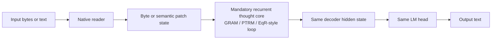
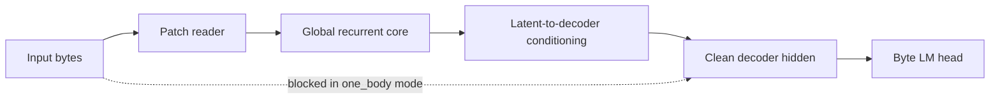
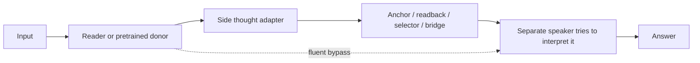

# One-Body Architecture SSOT

Date: 2026-05-24

Status: authoritative architecture contract after Stage99.

If this page conflicts with older experiment notes, this page wins for
from-scratch/general-LM/raw-intelligence work.

## Plain-Language Rule

The model must be one student:

```text
read the problem
-> think in the same internal body
-> speak from that same thought state
```

It must not be a fluent speaker with a separate thought organ taped on later.
That split-body pattern already failed in Stage99: the bridge learned signals,
but the final speaker did not treat them as answer-causal evidence.

## Canonical Promoted Path



The important part is not the module names. The important part is causal
ownership: the normal answer logits must be produced from the recurrent thought
state.

## One-Body Is Necessary, Not Sufficient

Stage99I showed the important second lesson:

```text
one body can still think into the wrong basin.
```

Plain-language read:

```text
The student is no longer a speaker with a side scratchpad. But when given more
thinking time, the student's mind may merely become calmer, not more correct.
The goal is not a quiet thought state. The goal is a thought state that pulls
the same LM head toward the right answer and away from tempting parrot answers.
```

Therefore a promoted one-body model must pass a stronger condition:

```text
read
-> think repeatedly
-> same LM head assigns higher probability to the intelligence answer
   and lower probability to the parrot answer
-> deeper thinking improves or preserves held-out language quality
```

This is the Solution-Aligned Answer Attractor requirement.

Current executable gate:

```text
scripts/569_eval_solution_aligned_answer_attractor_gate.py
```

The active paper-candidate extension is now:

```text
Internal Multi-Trajectory Answer Attractor
```

See:

```text
docs/wiki/architecture/internal-multitrajectory-answer-attractor-ssot.md
```

That file is the SSOT for GRAM/PTRM-style K-trajectory claims.  It says top-k
candidate selection is not enough; the publishable claim requires internal
trajectory generation, answer-attractor scoring, same LM-head speaking, and
causal ablations.

## Current BLT-D One-Body Implementation



Implementation contract:

- `--decoder-latent-mode one_body` removes the direct grouped-byte decoder
  shortcut from the clean decoder input.
- The reader may still use bytes to create patch embeddings. That is normal
  perception, not a shortcut.
- The decoder must not lower final CE by reading raw grouped byte embeddings
  while ignoring recurrent thought.
- Stage99-style bridge/readback knobs are blocked by default unless the run is
  explicitly diagnostic.

Current code anchors:

- `src/qtrm_mm/architecture/one_body_contract.py`: code SSOT for one-body
  launch guards and Stage99 diagnostic-bridge rejection.
- `src/qtrm_mm/architecture/component_registry.py`: code SSOT for
  promoted/diagnostic/deprecated/pending-extraction component status.
- `src/qtrm_mm/provenance.py`: example of proper I→G→A extraction
  (Stage102Z Provenance components moved from scripts/ to native src/
  following the Improvement→Generalization→Architecture-ization loop).
- Recent promotions (after large-scale joint ablation evidence):
  - stage102z_final_freeform_answer_path → PROMOTED (full_answer_path)
  - gated_thought_workspace_broadcast → PROMOTED
  - depthwise_monotonic_answer_attractor → PROMOTED
- Next track I-stage begun: native equation_binding + thought_workspaces scaffolding (core_equation_binding_* flags + gated proj in core, per stashed new thought structure).
- `src/qtrm_mm/models/blt_components.py`: reusable BLT local decoder and
  next-implicit byte projector components.
- `src/qtrm_mm/models/blt_prefixlm.py`: full BLT-D PrefixLM model class.
- `scripts/557_train_blt_d_prefixlm_dataio.py`: trainer/launcher that imports
  the BLT-D model class and uses `decoder_latent_mode=one_body`.
- `scripts/557_train_blt_d_prefixlm_dataio.py`: imports the code SSOT through
  `validate_one_body_architecture_contract`.
- `tests/test_one_body_architecture_contract.py`: reusable contract tests.
- `tests/test_architecture_component_registry.py`: executable BEST vs
  diagnostic/deprecated status tests.
- `tests/test_blt_components_ssot.py`: reusable BLT component import and shape
  tests.
- `tests/test_blt_eqr_attractor.py`: one-body shortcut and diagnostic-bridge
  guard tests.

## Stage104 Reading-Stability Anchor

Plain-language rule:

```text
Before trusting a new eye, compare it to a stable pair of glasses.
```

Stage104 established BPE as the local reading-stability control for the
Stage103 reasoning microscope. This does not mean BPE is the final architecture.
It means BPE is currently the cleanest way to ask whether the recurrent
one-body thought core can learn when reading is stable.

Current evidence:

```text
BPE Stage104B:
  eval loss 11.0748 -> 2.0018 over 240 steps
  eval_nonfinite_batches = 0
  depth4 loss 2.0018 beats depth1 loss 2.0807
  generation exact 1/16, repeated loops 0/16

BLT Stage103D corrected finite-row read:
  depth1 loss 1.7889 -> depth8 loss 1.7039
  but nonfinite_loss_rows = 8 and nonfinite_residual_rows = 17
```

Decision:

```text
BLT/H-Net/semantic-BLT is promising but not yet the main large-pretrain
tokenizer path. BPE itself is only an early stable reader, not a solved
reasoner after 240 steps. BLT must first match the BPE control on stable eval,
depth behavior, and non-degenerate free generation before large scale-up.
```

See:

```text
docs/wiki/decisions/2026-05-26-stage104-bpe-control-blt-reading-bottleneck.md
```

Current cleanup status:

- GRAM/PTRM-style thinking cores have reusable classes under `src/qtrm_mm`.
- BLT local decoder pieces and the full `BLTDByteLatentPrefixLM` class now live
  under `src/qtrm_mm/models`.
- The full BLT-D model remains a scaffold in `component_registry.py` until
  held-out/generation/depth gates promote it. Source placement alone is not a
  BEST claim.
- Rejected Stage99 bridge/readback/anchor/selector mechanisms may remain only
  as diagnostic code paths guarded by `one_body_contract.py`.
- Stage56/58 PTRM selected/oracle success is preserved as a diagnostic clue,
  not as proof of general LM ability. See
  [Past-Success Doubt Loop](../decisions/past-success-doubt-loop-stage56-stage58.md)
  before using old arithmetic accuracy to justify a new language run.
  Rebuild the comparison with `scripts/562_build_past_success_doubt_report.py`
  whenever a new "worked-before" run is used as evidence.
- Long `decoder_latent_mode=one_body` training is guarded in
  `one_body_contract.py`: runs at or above `--past-success-preflight-min-steps`
  require `--past-success-report-json`. If the report still says the
  restoration gate gap remains, a launch must pass
  `--past-success-restoration-gate-json` produced by
  `scripts/564_check_past_success_restoration_gate.py`, or explicitly pass
  `--acknowledge-past-success-restoration-gap` as a diagnostic override.
  The restoration gate must also avoid
  `current_checkpoint_recommendation=do_not_promote_current_checkpoint`.

## Runtime/Kernel Contract

Plain-language rule:

```text
Do not let the exam change the student's brain.
```

The one-body architecture claim is about the route from input bytes/text to the
same recurrent state and the same LM head. Runtime fallback pollutes that
evidence. If an experiment says "official GDN2 3:1", then the executed mixer
must really be official GDN2. If ptxas or the CUDA kernel path is wrong, the
experiment must stop instead of quietly using a different mixer.

Current strict contract:

- `official_gated_delta2` has no Torch fallback and no runtime fallback.
- Long official GDN2 runs must pass `--strict-backends`.
- DGX GB10 runs must set both:

  ```bash
  REQUIRED_TRITON_PTXAS_PATH=/usr/local/cuda-13.2/bin/ptxas
  TRITON_PTXAS_PATH=/usr/local/cuda-13.2/bin/ptxas
  ```

- Local runs must set their own explicit matching pair, for example the local
  CUDA 13.0 ptxas path if that is the installed toolchain.
- A checkpoint produced by an old fallback path is legacy evidence. Do not use
  it as a clean official-GDN2 resume base.
- `scripts/613_preflight_official_gdn2_contract.py` is the plain-language
  checker for this runtime contract. It should be run before continuing an
  official-GDN2 checkpoint, either directly or through:

  ```bash
  bash scripts/559_run_stage95_blt_partial_then_full_dgx.sh preflight
  ```

Why this belongs in the architecture SSOT:

```text
Architecture evidence = model path + actual runtime path.
```

If the actual runtime path changes under the same experiment name, then loss,
depth scaling, and generalization curves no longer explain the intended
architecture. That is evidence pollution, not robustness.

## Banned Main-Path Pattern



This is diagnostic-only after Stage99. It may be used to reproduce failure,
compare against the one-body route, or prove an ablation. It must not be
promoted as the main architecture.

## Hard Rejects

Reject a proposed main run before launch if any of these are true:

- Qwen-pretrained convenience is chosen before maintaining a born-one-body
  baseline.
- Adapter, sidecar, bridge, anchor, readback, or selector is the proposed main
  fix.
- The final LM head can answer through a raw byte/token shortcut that bypasses
  recurrent thought.
- The plan says the speaker can learn the bridge later without a same-head
  causal gate.
- `one_body` is treated as proof of reasoning. It is only the minimum routing
  hygiene.
- Recurrent-core-off, depth-off, or one-body-state-off can tie the full model.
- Teacher-forced CE improves but free generation samples remain degenerate.
- A long one-body run is launched without a current past-success doubt report
  and a current restoration-gate report covering loss, free generation,
  first-token behavior, repetition/EOS, and depth/recurrent ablation.

## Required Preflight Before GPU Time

Answer these in plain language before a local or DGX launch:

```text
1. Reader:
   What reads the input, and does it preserve what the thinker needs?

2. Thinker:
   Is recurrent thought mandatory on the normal answer path?

3. Speaker:
   Does the same LM head speak from the thought state, or from a bypass?

4. Training contract:
   Is this close to the strongest HRM-Text-like contract, or is the diff
   explicit and causal?

5. Data:
   Is the student reading enough language, reasoning, and multilingual text
   for the claimed ability?

6. Evaluation:
   Are we logging held-out loss, free generation, repetition, first-token
   behavior, and depth/adaptive probes?

7. Ablation:
   If the recurrent thought state is removed, does the gain disappear?
```

## Promotion Gate

A run can become the promoted architecture only if it satisfies all of this:

```text
same data / same token budget / same eval rows
one-body routing enabled
bridge/readback/selector disabled unless diagnostic
held-out loss or generation beats the current control
depth or adaptive compute has a measured benefit, or a measured reason to stay shallow
deeper recurrence improves answer-facing GD-lite margins on shortcut traps
critical shortcut axes pass: flipped-answer, successive-answer, truthy-answer
core/depth/state-off ablation loses the gain
free generation is non-degenerate
```

## Final-Architecture-First Rule

For the main research line, do not spend promotion budget on narrow
intermediate stages.  A reader-only parser, side ledger, verifier probe, or
card extractor can be diagnostic, but it is not the architecture.

The promoted experiment must test the whole route in one pass:

```text
input text / bytes
-> native reader
-> working-memory or provenance state
-> recurrent thought / graph-world update
-> checker or gated register when needed
-> same decoder / LM head answer
```

Plain-language rule:

```text
If the model only proves that one office inside the building works, do not call
it progress on the whole company.  Promote only the run where the same student
reads the problem, keeps the right notes, thinks, checks, and answers with the
same mouth.
```

Current registry status:

```text
promoted:
  stage102z_final_freeform_answer_path

diagnostic only:
  stage102f_prompt_provenance_frontend
  stage102g_freeform_provenance_frontend
```

Current limitation reading:

```text
If the model still fails broader language, evidence, or generation tests, do
not assume the architecture needs another side organ.  First keep the promoted
Stage102Z-style route intact and make the same body read harder natural data,
then require the same off-ablations to fail.
```

## Stage99I Evidence

Stage99I implemented the first one-body decoder gate.

```text
run: 20260524_STAGE99I_LOCAL_ONE_BODY_GATE400
eval loss: 2.5603
accepted: false

depth 1 loss/residual: 2.5620 / 0.6703
depth 2 loss/residual: 2.5604 / 0.1890
depth 4 loss/residual: 2.5784 / 0.0994
depth 8 loss/residual: 2.6086 / 0.0544

best adaptive loss: 2.5604 @ threshold 0.3
selected depth: 2

generation gate:
  first response accuracy: 1.0000 on 128 rows
  free generation exact: 0/8
  ended with EOS: 0/8
  prefix token accuracy: 0.1348

restoration gate:
  all required signals present: true
  current checkpoint recommendation: do_not_promote_current_checkpoint
  warnings: free_generation_exact_zero, generation_never_reaches_eos,
    depth_probe_rejected, no_depth_loss_gain

generalization + efficiency depth sweep:
  report: local_eval/20260525_STAGE100_LOCAL_STAGE99I_GD_DEPTH_SWEEP/summary.json
  solution-aligned gate:
    local_eval/20260525_STAGE100_LOCAL_STAGE99I_GD_DEPTH_SWEEP/solution_aligned_answer_attractor_gate.json
  accepted: false

  depth 1 GD-lite acc/margin: 0.3333 / -0.0080
  depth 2 GD-lite acc/margin: 0.3333 /  0.0036
  depth 4 GD-lite acc/margin: 0.3333 / -0.0049
  depth 8 GD-lite acc/margin: 0.5000 / -0.0452
  depth16 GD-lite acc/margin: 0.5000 / -0.0575

  failed solution-aligned checks:
    gd_mean_margin_improves
    critical_tasks_pass
    heldout_loss_not_regressed
```

Interpretation:

The direct decoder shortcut is gone, but the recurrent state is not yet an
answer attractor. It can place the first response byte, and deeper recurrence
can make the hidden state more stable, but deeper recurrence still does not
pull the same LM head consistently toward the intelligence answer. The next
work must preserve one-body routing and add solution-aligned attractor training
or state updates. Do not go back to bridge/anchor/readback/selector as the main
fix.

## One-Sentence Memory Hook

```text
If the same body does not read, think, and speak, it is not the main path.
```
