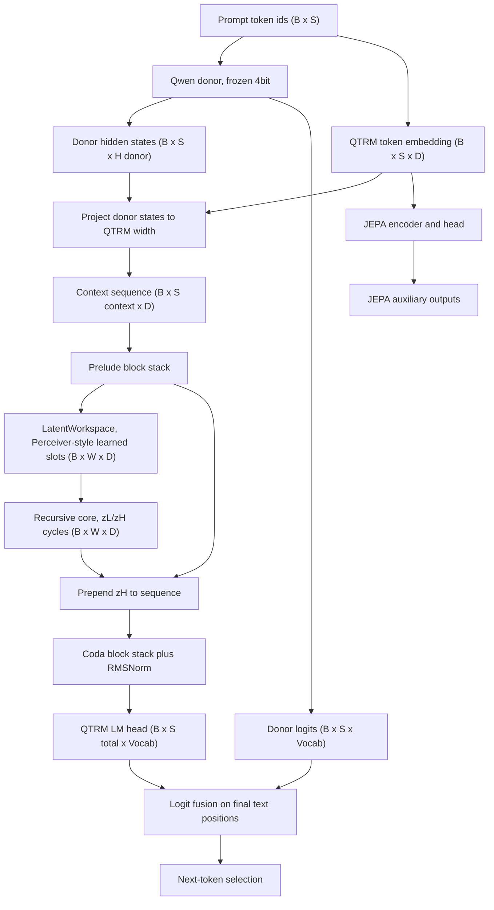
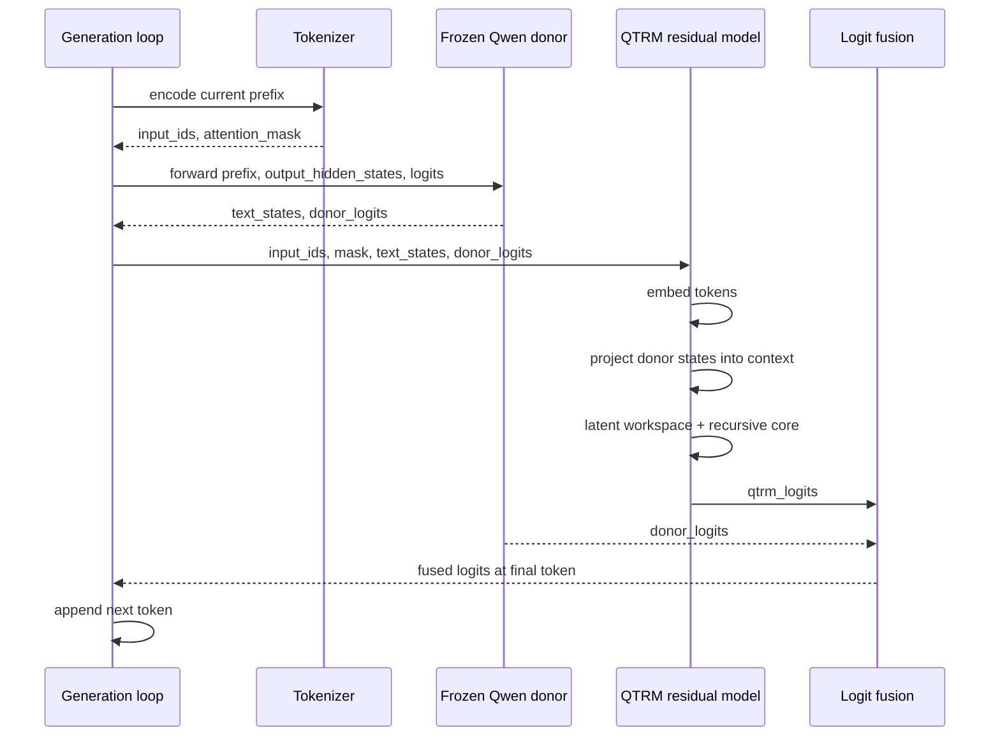
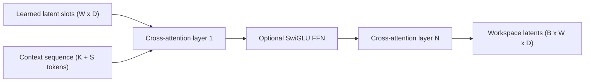
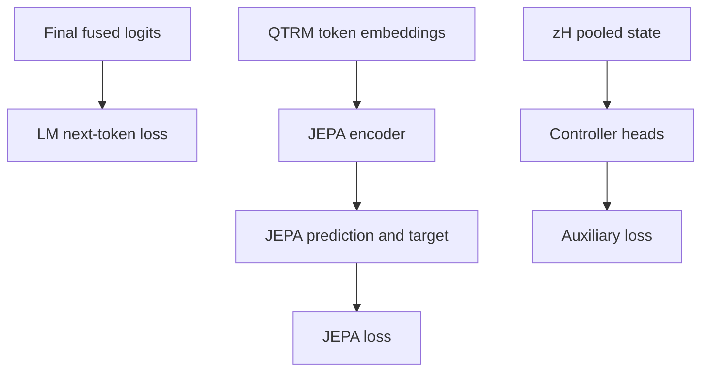

# QTRM Forward Pass Architecture

Status: implementation snapshot as of 2026-04-29.

Primary code paths:

- `src/qtrm_mm/qtrm_model.py`
- `src/qtrm_mm/qwen_donor.py`
- `src/qtrm_mm/workspace.py`
- `src/qtrm_mm/core.py`
- `src/qtrm_mm/multimodal_projector.py`

## Summary

Current QTRM is not a standalone language model. It is a donor-backed residual
architecture:

- Qwen donor provides the frozen language prior and optional donor logits.
- QTRM embeds the same token ids, projects donor hidden states into QTRM-width
  context tokens, builds a latent workspace, runs a recurrent z_L/z_H core, and
  emits a small residual LM-logit contribution.
- Final text-token logits are fused as:

```text
final_logits = donor_logits_scale * donor_logits
             + qtrm_logits_scale * qtrm_logits
```

The current stable residual pilot uses:

```text
donor_logits_scale = 1.0
qtrm_logits_scale  = 0.10
workspace_tokens   = 64
workspace_layers   = 3
workspace_ff_mult  = 2
```

This means the model performs computation in a learned latent workspace, but it
does not yet prove independent latent reasoning or a latent-only language
generator. The donor remains the base decoding policy.

## Architecture Classification

QTRM can be described as looped and latent-space in the architectural sense:

- `LatentWorkspace` creates learned latent slots over donor/text context.
- `QTRMRecursiveCore` repeatedly updates `z_l` and `z_h` states.
- `z_h` is fed into the coda and can influence residual logits.

The precise label is:

```text
Qwen-backed looped latent-workspace residual adapter
```

It is not yet a standalone loop LM, because Qwen donor logits remain the base
language policy. It is also not yet evidence of proven latent reasoning, because
the current experiments mainly establish generation stability.

## Concept Flow



## Generation Sequence

At autoregressive inference time, donor features must be refreshed for the full
generated prefix on every step. Holding donor hidden states at the initial prompt
length is a consistency bug.



Mermaid 8.8.0 note: avoid `Loop` as a sequence participant id. The parser
treats it as the reserved `loop` keyword in some renderers, so the diagram uses
`Gen` instead.

## Shape Ledger

Symbols:

- `B`: batch size
- `S`: original token sequence length
- `D`: QTRM model width, for example `512`
- `H_donor`: Qwen hidden width, for example `2048`
- `V`: vocabulary size, for Qwen3.5-2B tokenizer `248320`
- `K`: projected donor context token count, capped by `max_visual_tokens`
- `W`: latent workspace token count, for current residual pilot `64`

| Stage | Tensor | Shape | Notes |
| --- | --- | --- | --- |
| Input | `input_ids` | `[B, S]` | Same ids go to donor and QTRM. |
| Input | `attention_mask` | `[B, S]` | Must come from tokenizer pad id, not a hardcoded `0`. |
| Donor | `text_states` | `[B, S, H_donor]` | Frozen Qwen final hidden states. |
| Donor | `donor_logits` | `[B, S, V]` | Optional; required for donor-logit residual mode. |
| QTRM embed | `text_seq` | `[B, S, D]` | Learned QTRM token embeddings. |
| Donor projection | projected donor states | `[B, K, D]` | Implemented by `MultimodalProjector`; `K <= max_visual_tokens`. |
| Context | `seq` | `[B, K + S, D]` | Projected donor states are prepended to QTRM token embeddings. |
| Prelude | `seq` | `[B, K + S, D]` | Causal block stack. |
| Workspace | `workspace` | `[B, W, D]` | Learned latent slots cross-attend to context. |
| Recursive core | `z_l`, `z_h` | `[B, W, D]` | TRM-style fast/slow recurrent workspace states. |
| Coda input | `cat(z_h, seq)` | `[B, W + K + S, D]` | `z_h` is prepended to the context sequence. |
| QTRM LM head | `qtrm_logits` | `[B, W + K + S, V]` | Scaled by `qtrm_logits_scale`. |
| Fusion | trailing text logits | `[B, S, V]` | Donor logits are added only to the final original text-token segment. |

The logit alignment in `QTRMMultimodalModel.forward` computes:

```text
text_offset = logits.shape[1] - S
logits[:, text_offset:, :] += donor_logits * donor_logits_scale
```

Therefore donor logits do not apply to workspace tokens or projected donor
context tokens. They apply only to the trailing original text-token positions.

## Latent Workspace Contract

`LatentWorkspace` is a Perceiver/OpenFlamingo-style in-context workspace:



Current controls:

- `workspace_layers`: number of repeated latent cross-attention layers.
- `workspace_ff_mult`: enables per-layer SwiGLU feed-forward updates when
  greater than `0`.
- `workspace_include_latents_in_kv`: lets latents join context key/value tokens
  during each workspace layer.

Design boundary:

- This is working memory over the current prompt/prefix.
- It is not yet persistent MemoryOS storage.
- It is not yet evidence of hidden chain-of-thought reasoning.

## Loss Paths



In the current residual baseline, `loss_jepa_weight=0.0` and
`loss_aux_weight=0.0`, so the active optimization target is LM loss through the
donor-backed fused logits. JEPA and controller outputs still exist in the model
return dictionary, but they are not driving the residual pilot loss.

## Documentation Rule

For this project, maintain three architecture views:

1. Mermaid flowcharts for human-readable component boundaries.
2. Mermaid sequence diagrams for training/inference execution order.
3. Shape ledgers tied to source files for implementation checks.

Mermaid diagrams should explain intent; shape ledgers should prevent us from
accidentally documenting an architecture that the code does not implement.
