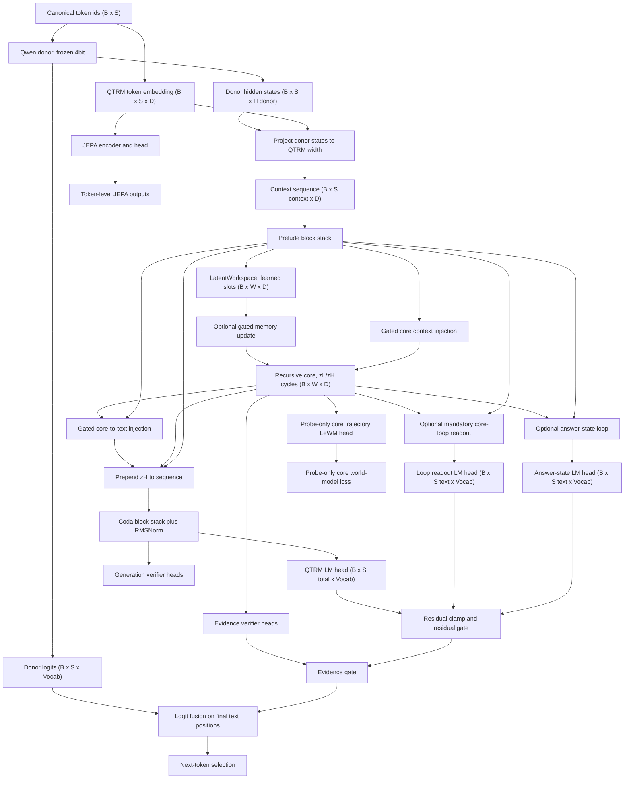
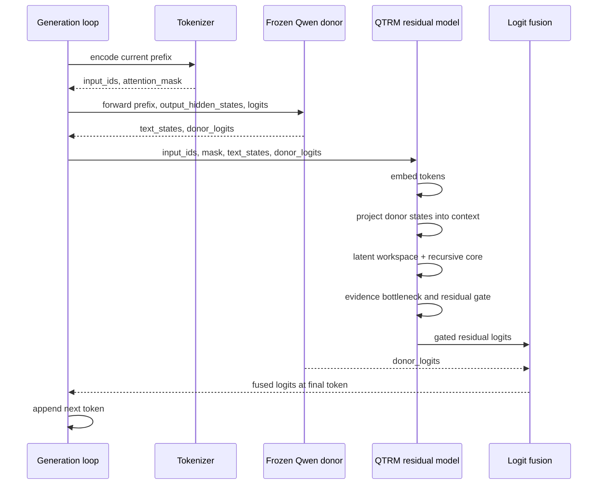
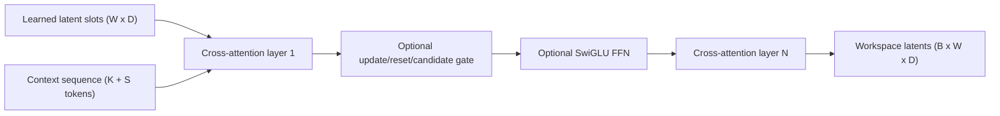
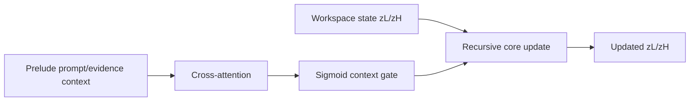
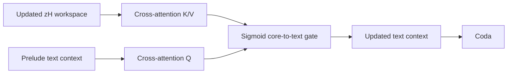
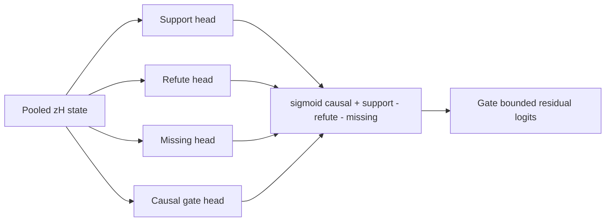
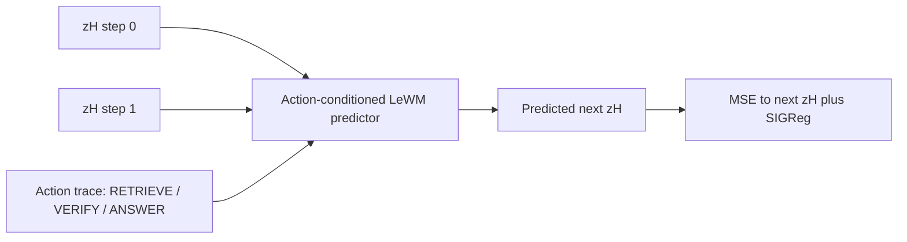
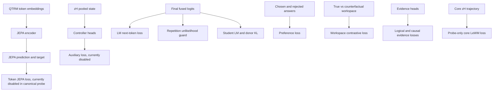

# QTRM Forward Pass Architecture

Status: implementation snapshot as of 2026-05-03.

Primary code paths:

- `src/wgram_lm/wgram_model.py`
- `src/wgram_lm/qwen_donor.py`
- `src/wgram_lm/workspace.py`
- `src/wgram_lm/core.py`
- `src/wgram_lm/multimodal_projector.py`

## Summary

Current QTRM is still donor-scaffolded, but the canonical raw-intelligence
claim is no longer the donor-backed LeWM residual probe. The current
representative raw-intelligence architecture is documented in
[Canonical Architecture Matrix](canonical-architecture-matrix.md) and is based
on `configs/qwen35_2b_4090_pure_recursive_answer_state_loop_causal_prefix_s160.yaml`.
The model boundary starts at a canonical token stream. MemoryOS retrieval,
reranking, source selection, and chat-template compilation are runtime/system
components, not internal model blocks. See
[QTRM Model vs Runtime Boundary](model-vs-runtime-boundary.md).

- Qwen donor provides the frozen language prior and optional donor logits.
- QTRM embeds the same token ids, projects donor hidden states into QTRM-width
  context tokens, builds a latent workspace, runs a recurrent z_L/z_H core, and
  emits a small residual LM-logit contribution.
- In the OpenMythos-style v2 warmup path, recurrent `z_H` is also injected
  directly back into the text context through a gated cross-attention path before
  coda. This reduces the unchanged text-context bypass and gives core ablations
  a clearer causal target.
- In the raw-intelligence KISS path, `core_loop_readout_enabled=true` bypasses
  coda for answer logits and reads final text-token logits directly from the
  recursive loop state. With `core_loop_readout_requires_core=true`, the QTRM
  residual answer path is zero when `disable_core=true`.
- The newer TRM-style answer-state probe uses
  `answer_state_loop_enabled=true`: text answer state `y` is initialized from
  the canonical prompt stream and then updated once per recursive core state,
  `y_t = update(y_{t-1}, z_H_t)`. This is stricter than a final readout because
  the answer representation itself must evolve through the loop.
- Optional generation-verifier heads score repeat, stop, and quality failures
  from the coda/post-norm last valid text hidden state. They are probe-only for
  now; they are not used as a hard decoding gate.
- Runtime evaluation and inference can suppress visible reasoning markers such
  as `<think>`/`</think>` and apply no-repeat n-gram suppression to enforce a
  safer visible-answer channel. This is a decoding contract, not proof that the
  latent core learned hidden reasoning. Long prompt suffix contracts are still
  experimental because they can induce instruction drift with the raw base
  donor.
- Final text-token logits in donor-fusion mode are fused as:

```text
bounded_residual = clamp(qtrm_lm_head * qtrm_logits_scale)
bounded_residual = residual_gate * bounded_residual

if evidence_bottleneck_applies_to_residual:
    bounded_residual = evidence_gate * bounded_residual

final_text_logits = donor_logits_scale * donor_logits
                  + bounded_residual
```

The current canonical probe uses:

```text
donor_logits_scale              = 0.0
qtrm_logits_scale               = 1.0
qtrm_residual_clamp             = null
qtrm_residual_gate_enabled      = false
workspace_tokens                = 64
workspace_layers                = 3
workspace_memory_gate_enabled   = false in current pure-recursive config
core_context_enabled            = true
answer_state_loop_enabled       = true
answer_state_loop_requires_core = true
core_step_conditioning_enabled  = true
core_to_text_enabled            = false
coda_attn_every                 = 1
evidence_bottleneck_enabled     = false
core_world_model_enabled        = false
loss_core_world_model_weight    = 0.0
```

This means the model performs computation in a learned latent workspace, but it
does not yet prove independent latent reasoning or a latent-only language
generator. Donor hidden states remain scaffold context; donor logits are
disabled in the canonical raw-intelligence path.

Important boundary: donor-free QTRM generation now uses `qtrm_residual_logits`
as the final logits path. This was fixed after the pure-recursive gate showed
that donorless runs were not faithfully testing the residual/core answer path.

## Architecture Classification

QTRM can be described as looped and latent-space in the architectural sense:

- `LatentWorkspace` creates learned latent slots over donor/text context.
- `QTRMRecursiveCore` repeatedly updates `z_l` and `z_h` states.
- `z_h` is fed into the coda and can influence residual logits.
- `coda_attn_every` can override the global sparse-attention schedule so the
  coda has at least one explicit attention layer from text tokens back to the
  latent prefix.

The precise label is:

```text
Qwen-scaffolded single-trace latent recursive adapter
```

It is not yet a standalone loop LM, because Qwen donor hidden states still
scaffold the prompt representation. In the canonical raw-intelligence path,
however, Qwen donor logits are disabled, so answer scoring is not donor-logit
residual fusion.

Terminology note: [QTRM Terminology](../concepts/qtrm-terminology.md) defines
the stricter language for "actual reasoning" versus trace-pattern imitation.
In this wiki, latent reasoning should mean a causally necessary workspace/core
state update that improves held-out answers and fails under the right ablation.

## Model-Only Concept Flow



Runtime MemoryOS flow is intentionally not drawn inside this model diagram. The
runtime version is:

```text
user prompt
-> optional MemoryOS retrieval/rerank/source selection
-> Context Compiler / chat-template builder
-> canonical token ids
-> QTRM model-only flow above
```

`workspace_text_states` remains in code as an ablation/probe input for hidden
evidence experiments. It should not be presented as the canonical model
architecture.

## Generation Sequence

At autoregressive inference time, donor features must be refreshed for the full
generated prefix on every step. Holding donor hidden states at the initial prompt
length is a consistency bug.



Mermaid 8.8.0 note: avoid `Loop` as a sequence participant id. The parser
treats it as the reserved `loop` keyword in some renderers, so the diagram uses
`Gen` instead.

## Raw Gate Scoring Contract

Pure-recursive reasoning gates use causal forced-choice scoring:

```text
for each candidate answer token i:
  prefix = prompt + candidate_answer_tokens[:i]
  score token_i from QTRM(prefix)
```

The older one-shot forced-choice path `QTRM(prompt + full candidate answer)` is
not strict enough for QTRM because the latent workspace/core can read the whole
provided sequence. It remains useful only as a diagnostic. Canonical
raw-intelligence reports should use `scoring=causal_forced_choice`.

## Shape Ledger

Symbols:

- `B`: batch size
- `S`: original token sequence length
- `D`: QTRM model width, for example `512`
- `H_donor`: Qwen hidden width, for example `2048`
- `V`: vocabulary size, for Qwen3.5-2B tokenizer `248320`
- `K`: projected donor context token count, capped by `max_visual_tokens`
- `W`: latent workspace token count, for current residual pilot `64`

| Stage | Tensor | Shape | Notes |
| --- | --- | --- | --- |
| Input | `input_ids` | `[B, S]` | Canonical token stream. Same ids go to donor and QTRM. |
| Input | `attention_mask` | `[B, S]` | Must come from tokenizer pad id, not a hardcoded `0`. |
| Donor | `text_states` | `[B, S, H_donor]` | Frozen Qwen final hidden states. |
| Donor | `donor_logits` | `[B, S, V]` | Optional; required for donor-logit residual mode. |
| Workspace probe input | `workspace_text_states` | `[B, R, H_donor]` | Probe-only hidden evidence/memory states. Not part of the canonical model architecture. |
| Workspace probe input | `workspace_attention_mask` | `[B, R]` | Masks padded probe states before workspace projection. |
| QTRM embed | `text_seq` | `[B, S, D]` | Learned QTRM token embeddings. |
| Donor projection | projected donor states | `[B, K, D]` | Implemented by `MultimodalProjector`; `K <= max_visual_tokens`. |
| Context | `seq` | `[B, K + S, D]` | Projected donor states are prepended to QTRM token embeddings. |
| Workspace probe projection | projected probe states | `[B, R', D]` | Used only in workspace/dual ablation modes; does not define the product-facing model input. |
| Prelude | `seq` | `[B, K + S, D]` | Causal block stack. |
| Workspace | `workspace` | `[B, W, D]` | Learned latent slots cross-attend to prompt context plus optional workspace-only evidence. |
| Recursive core | `z_l`, `z_h` | `[B, W, D]` | TRM-style fast/slow recurrent workspace states. |
| Core trajectory | `core_depth_states` | `[B, T_core, D]` | First workspace token from each recursive `z_h` step. Used by core LeWM probe. |
| Answer-state loop | `answer_state_loop_hidden` | `[B, S, D]` | Optional TRM-style recurrent answer state after the final core step. |
| Answer-state depth states | `answer_state_loop_depth_hidden` | `[B, T_core, S, D]` | Optional answer state after each recursive depth. Used by pure-recursive depth supervision. |
| Answer-state logits | `answer_state_loop_logits` | `[B, S, V]` | Optional final text-token logits from `LMHead(y_T)`. With `answer_state_loop_requires_core=true`, this path is zero when `disable_core=true`. |
| Core world model | `core_world_model_pred`, `core_world_model_target` | `[B, T_core - horizon, D]` | Optional LeWM-style prediction over recursive core states. |
| Core context | `core_context_gate_mean` | `[B, G]` | Mean gate telemetry for optional gated context injection into the recursive core. |
| Core-to-text gate | `core_to_text_gate_mean` | `[B]` or `[B, 0]` | Mean gate telemetry for optional direct `z_H -> text_context` injection. |
| Evidence verifier | support/refute/missing/gate logits | `[B]` | Pooled `z_h` controls evidence-backed residual writing. |
| Coda input | `cat(z_h, seq)` | `[B, W + K + S, D]` | `z_h` is prepended to the context sequence. |
| Generation verifier | repeat/stop/quality logits | `[B]` | Optional probe heads read the coda/post-norm last valid text hidden state. |
| QTRM LM head | `qtrm_logits` | `[B, W + K + S, V]` | Scaled by `qtrm_logits_scale`. |
| QTRM residual | `qtrm_residual_logits` | `[B, W + K + S, V]` | Clamped and gated residual used in donor-fusion mode. |
| Fusion | trailing text logits | `[B, S, V]` | Donor logits are added only to the final original text-token segment. |

The logit alignment in `QTRMMultimodalModel.forward` computes:

```text
text_offset = logits.shape[1] - S
logits = qtrm_residual_logits.clone()
logits[:, text_offset:, :] += donor_logits * donor_logits_scale
```

Therefore donor logits do not apply to workspace tokens or projected donor
context tokens. They apply only to the trailing original text-token positions.

## Latent Workspace Contract

`LatentWorkspace` is a Perceiver/OpenFlamingo/Q-Former-style in-context
workspace with an optional LM2/G-MemLLM-style gated update:



Current controls:

- `workspace_layers`: number of repeated latent cross-attention layers.
- `workspace_ff_mult`: enables per-layer SwiGLU feed-forward updates when
  greater than `0`.
- `workspace_include_latents_in_kv`: lets latents join context key/value tokens
  during each workspace layer.
- `workspace_memory_gate_enabled`: enables GRU-style update, reset, and
  candidate projections over each latent slot.
- `workspace_memory_gate_init_bias`: initializes the update gate bias. Negative
  values make the layer conservative at the start of training.

Telemetry and ablation:

- `workspace_update_gate_mean`: per-batch, per-layer mean update-gate value.
- `workspace_memory_token_count`: active retrieved-evidence memory tokens used
  by the workspace path.
- `disable_workspace_memory_gate=True`: runtime ablation used by
  `qtrm_workspace_gate_off_with_evidence`.
- `disable_workspace_memory_context=True`: runtime ablation used by
  `qtrm_workspace_memory_off_with_evidence`.

## Recursive Core Context Contract

`QTRMRecursiveCore` can optionally read the prelude context directly through
gated cross-attention:



Current controls:

- `core_context_enabled`: enables gated cross-context injection.
- `core_context_gate_init_bias`: initializes the gate conservatively.
- `disable_core_context=True`: runtime ablation used by
  `qtrm_core_context_off_with_evidence`.
- `core_context_gate_mean`: telemetry for whether the gate is active.

This path lets the cognitive core read prompt/evidence context directly without
adding hidden evidence tokens to the coda/text output path.

## Core-To-Text Contract

The OpenMythos-style v2 path adds a second direction after the recursive update:



Current controls:

- `core_to_text_enabled`: enables direct `z_H -> text_context` injection.
- `core_to_text_gate_init_bias`: initializes the injection conservatively.
- `core_to_text_gate_min`: optional floor to prevent total gate closure.
- `disable_core_to_text=True`: runtime ablation for testing whether recursive
  latent state changes text logits.
- `core_to_text_gate_mean`: telemetry for the average gate strength.

This is the conservative QTRM adaptation of OpenMythos's no-bypass rule:
OpenMythos loops the token hidden state itself, while QTRM loops a latent
workspace and therefore needs a direct bridge back into text-token states before
the coda. It is still donor-backed residual generation, not a standalone
OpenMythos clone.

Design boundary:

- This is working memory over the current prompt/prefix.
- It is not yet persistent MemoryOS storage.
- It is not yet evidence of hidden chain-of-thought reasoning.
- The gated update is inspired by LM2/G-MemLLM memory lanes, but it is not a
  faithful implementation of either architecture.

## Evidence Bottleneck Contract

The logical-causal evidence bottleneck decides whether QTRM residual logits are
allowed to affect the donor-backed answer.



Current controls:

- `evidence_bottleneck_enabled`: enables support/refute/missing/causal heads.
- `evidence_bottleneck_applies_to_residual`: decides whether the evidence gate
  multiplies the whole QTRM residual path. General loop-LM-style warmups set
  this to `false`; strict evidence-only proof probes can set it to `true`.
- `evidence_bottleneck_gate_init_bias`: initializes the causal gate
  conservatively.
- `evidence_bottleneck_suppress_without_workspace`: closes the residual gate
  when no workspace evidence is present if the gate is applied to residuals.
- `disable_evidence_bottleneck=True`: runtime ablation used by
  `qtrm_evidence_bottleneck_off_with_evidence`.

Training losses:

- `loss_logical_evidence_weight`: support/refute/missing head supervision.
- `loss_causal_evidence_gate_weight`: evidence gate supervision.
- `loss_workspace_contrastive_weight`: true workspace evidence must outscore
  counterfactual workspace evidence.

## Probe-Only Core LeWM Contract

The core LeWM path remains implemented as a probe. It applies
LeWorldModel-style next-embedding prediction to the TRM-like recursive core
trajectory:



Current controls:

- `core_world_model_enabled`: enables the core trajectory predictor.
- `loss_core_world_model_weight`: trains the predictor with the LeWM loss.
- `core_world_model_sigreg_weight`: applies SIGReg to the core trajectory.

Boundary:

- It is disabled in the canonical single-trace TRM architecture.
- The current action trace is fixed probe metadata, not a learned policy.
- This is not full LeWorldModel pixel trajectory training.
- Current results show low latent transition MSE without better symbolic
  intermediate-state accuracy, so it is not proof of better reasoning.

## Loss Paths



In the current canonical single-trace TRM probe, token-level
`loss_jepa_weight=0.0`, `loss_aux_weight=0.0`, and
`loss_core_world_model_weight=0.0`. Token JEPA, controller outputs, and
core-world-model outputs still exist in the codebase, but they are not active
canonical optimization targets. LeWM is retained only as a probe until a
semantic transition or answer-causal gate passes.

For the current pure-recursive raw-intelligence gate, the accepted canonical
training contract is narrower:

- one visible prompt token stream;
- no MemoryOS, retrieval, evidence side path, or hidden answer context;
- causal forced-choice evaluation;
- causal-prefix depth supervision for the first answer token;
- mandatory answer-state loop core path.

The multi-token causal-prefix path exists as an experiment option, but
`pure_recursive_answer_state_loop_causal_prefix_multitoken_s080` was rejected
because it reduced core8 from the accepted baseline `6/16` to `4/16`. Do not
promote later-token loss as canonical unless it preserves the first-token
depth gain and improves a held-out multi-token family such as list transforms.
The split later-token weighted variant
`pure_recursive_answer_state_loop_causal_prefix_split_s080` was also rejected
because core8 tied donor at `5/16` instead of beating it. This makes
later-token CE a probe-only path for now, not a canonical raw-intelligence
training target.

## Implemented But Not Canonical

See [Canonical Architecture Matrix](canonical-architecture-matrix.md) for the
full ledger. The main non-canonical implemented paths are:

- token-level JEPA loss;
- controller auxiliary policy heads;
- core halting / early exit;
- donor annealing;
- multimodal image scaffold;
- external MemoryOS reranker and retrieval tools.

## Documentation Rule

For this project, maintain three architecture views:

1. Mermaid flowcharts for human-readable component boundaries.
2. Mermaid sequence diagrams for training/inference execution order.
3. Shape ledgers tied to source files for implementation checks.

Mermaid diagrams should explain intent; shape ledgers should prevent us from
accidentally documenting an architecture that the code does not implement.
