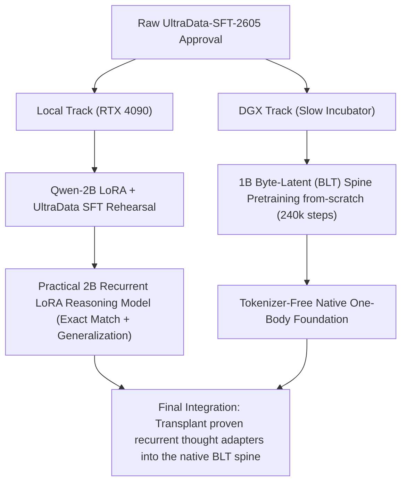

# 0002 Two-Track Recurrent LoRA vs Byte-Latent Pretraining Split

**Date**: 2026-05-29
**Status**: ACTIVE POLICY (Approved by user "마일스톤대로 진행해, 투 트랙으로 하자")

---

## 1. Context & Core Hypothesis

Following the successful restoration of **M1 (Stochastic Recurrent Breadth)** and **M2 (Elastic Recurrence Depth policy learning)** under sequential exact-match verification, the project has reached a critical strategic milestone. Instead of treating the Local RTX 4090 solely as a "microscope" and the DGX solely as a "pretrain incubator," we are officially promoting the workflow into a **Dual-Spine / Two-Track Development and Co-Evolution Strategy**.

### The Split Rationale:
1. **Local Track (RTX 4090 - Recurrent LoRA Engine)**:
   - **Hypothesis**: Qwen-3.5-2B-Base already possesses immense pre-trained knowledge. We do not need to spend massive DGX compute retraining this backbone.
   - **Action**: By capturing the loop-wise **Mythos LoRA (rank 8)** adapters alongside the newly wired **halting policy & halting BCE loss**, we can train "the muscle of recurrent thinking" using the high-quality **UltraData-SFT-2605 (Math, Code, IF, Knowledge)** dataset.
   - **Deliverable**: An immediately deployable, robust, and highly practical **2B Recurrent LoRA Reasoning Model** matching or beating generalist reasoning baselines.

2. **DGX Track (Server - 1B Byte-Latent Foundation from-scratch)**:
   - **Hypothesis**: Traditional BPE tokenizers are structurally bottlenecked by extreme multilingual fragmentation.
   - **Action**: Pretrain a completely **Tokenizer-Free 1B Byte-Latent Recurrent (BLT) Spine** from-scratch over 240,000 steps using offline static/dynamic OPUS minimax selection.
   - **Deliverable**: A clean, tokenizer-free foundation model that is structurally immune to multilingual vocabulary fertility degradation, ready to receive the loop-wise recurrent thought transplant.

---

## 2. Empirical Diagnostics: The Tokenizer Fragmentation Wall

To prove the necessity of the DGX Byte-Latent Track, we ran the multilingual tokenizer fertility auditor (`scripts/543_audit_prefixlm_multilingual_tokenizer.py`) on our BPE Trained Tokenizer. The empirical results definitively justify the two-track split:

* **Multilingual Probe Status**: `WARN` (Korean fertility warning active)
* **Empirical Fertility Rates (Tokens per Non-Space Character)**:

| Language (ISO) | Probe Cases | Mean Fertility | Max Fertility | Fragmentation Threat |
|---|---|---|---|---|
| **English (en)** | 8 | **0.307** | **0.407** | Ideal (1 token covers multiple characters) |
| **Spanish (es)** | 2 | **0.332** | **0.337** | Ideal |
| **German (de)** | 2 | **0.391** | **0.500** | Ideal |
| **Korean (ko)** | 4 | ⚠️ **1.439** | ⚠️ **2.667** | **Severe (1 character shredded into 1.4 ~ 2.6 tokens)** |

### Causal Implication:
In a recurrent weight-tied looped architecture, having a fertility rate of **2.667** for Korean means that a single Korean word triggers more than double the recurrent state transitions of an English word. This floods the thought manifold with sequential update noise, accelerating representation drift.
- The **Local 2B LoRA track** manages this via LoRA adapter steering.
- The **DGX 1B BLT track** solves this natively by removing BPE entirely.

---

## 3. Telemetry & Active Processes (As of 2026-05-29)

### Local 4090:
- **UltraData-SFT-2605 Download**: Active under **`task-2094`**. Bandwidth is extremely stable, downloading shard files sequentially into `data/raw/` at a rate of **~4.0s per file**.
- **Next Step**: Prepare `configs/` and scripts to run SFT + Rehearsal over the local 2B LoRA checkpoint as soon as datasets finish landing.

### DGX Server:
- **Supervisor Active**: **`stage95_supervisor_pid=15409`** successfully launched in clean state.
- **Log target**: `/tmp/20260529_STAGE95G_SUPERVISOR.log`
- **Output directories**:
  - Partial: `local_eval/20260529_STAGE95G_DGX_1B_PARTIAL`
  - Full: `local_eval/20260529_STAGE95I_DGX_1B_FULL`
- **OPUS config**: `ONLINE_OPUS_ENABLED=1`, `GD_LITE_ENABLED=1`, `OPUS_PROXY_SCORE_MODE=minimax_mean`.
