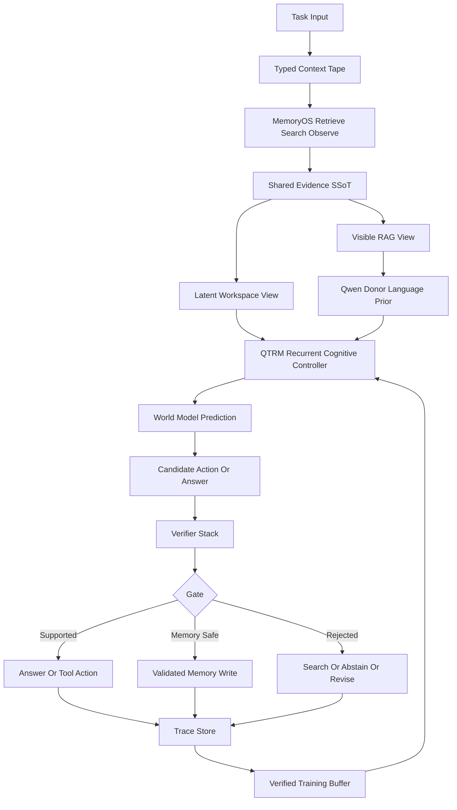

# ASI Root Architecture Reset

Status: root-architecture reset proposal, 2026-05-01.

## Boundary

This document does not claim QTRM is ASI. It defines the architecture I would
move toward if the current direction is too local or over-patched.

The key reset is:

```text
QTRM should not try to become a standalone fluent LLM first.
QTRM should become a causal cognitive controller over donor language,
MemoryOS, tools, verification, world-model prediction, and self-improvement
traces.
```

## Why The Current Direction Is Suspect

The recent failures are not only training-step failures.

| Symptom | Root concern |
| --- | --- |
| Repetition after more training | Free-form residual logits can damage donor language before reasoning is proven. |
| Workspace/core ablations sometimes match full model | Latent workspace and recurrent core are not always causally necessary. |
| Retrieved evidence present but answer wrong | Retrieval and answer formation are not joined by a forced evidence-use path. |
| Many gates/losses accumulate | Local guard heads can hide failures without fixing the information path. |
| Hidden workspace-only evidence was confusing | Ordinary LLM/RAG systems usually condition visible context; hidden-only should remain a causality probe, not the canonical user path. |

The replacement architecture should therefore make the harness, memory,
verifier, latent core, world model, and training buffer separately measurable.

## New Root Claim

One-sentence claim:

```text
QTRM is a donor-preserving residual cognitive controller that improves action,
evidence-use, and self-improvement decisions through a verified closed loop.
```

Falsifier:

```text
If donor-only plus external harness/verifier matches QTRM on held-out tasks,
or if disabling QTRM latent/core paths does not reduce score, QTRM is not the
cognitive core yet.
```

Simpler baseline to beat:

```text
Qwen donor + scripted MemoryOS retrieval + external verifier/reranker
```

## ASI Cognitive Loop V0

Mermaid 8.8-compatible diagram:



## Component Contract

| Component | New responsibility | Must not do |
| --- | --- | --- |
| Typed Context Tape | Store prompt, evidence, tool observations, actions, verifier status as one trace format | Hide important evidence in untracked side paths |
| Qwen donor | Preserve fluent language prior and renderer behavior | Be overwritten by unbounded QTRM residuals |
| QTRM recurrent core | Select actions, evidence spans, halt depth, and residual corrections | Claim truth without verifier/evidence support |
| World model head | Predict next latent state or consequence before action/answer | Be counted as useful from auxiliary loss alone |
| Verifier stack | Check support/refute/missing, contradiction, executable tests, citation grounding | Only rerank after damage without feeding learning gates |
| MemoryOS | External auditable long-term memory and trace store | Commit self-generated facts without validation |
| Training buffer | Hold only verified traces, rejected alternatives, and regression results | Mix unchecked self-generated corrections into SFT |

## Code Contract Added

The first implementation slice is deliberately small:

- `src/wgram_lm/agentic/cognitive_loop.py`
- `src/wgram_lm/agentic/context_tape.py`
- `src/wgram_lm/agentic/causal_gate.py`
- `src/wgram_lm/agentic/harness.py`
- `src/wgram_lm/agentic/trace_replay.py`
- `tests/test_asi_cognitive_loop_contract.py`
- `tests/test_asi_causal_loop_gate_script.py`
- `scripts/154_build_asi_causal_loop_gate.py`
- `scripts/155_build_controller_trace_replay.py`
- `scripts/155_run_controller_trace_train.sh`
- `configs/qwen35_2b_4090_controller_trace_s050.yaml`
- `configs/qwen35_2b_4090_controller_trace_s300.yaml`
- `scripts/156_eval_controller_trace_policy.py`

It fixes three root rules in code:

```text
1. generated memory writes default to quarantine unless all validation gates pass;
2. observe-action-observation-verifier traces are JSON-serializable training sources;
3. ASI-oriented claims are rejected unless required causal gates pass.
4. the Stage-0 scripted harness records
   `RETRIEVE_MEMORY -> VERIFY_EVIDENCE -> ANSWER` transitions as a baseline.
5. prompt, workspace, verifier, and training views derive from one
   `TypedContextTape.context_hash`.
6. trace replay exposes action targets and verifier rewards for controller
   training.
7. causal-loop reports are accepted only when QTRM beats donor/scripted harness
   baselines and latent-core/world-model/verifier ablations drop enough.
8. trace-replay rows can now supervise `ControllerHeads.action` through an
   explicit action-policy CE loss while all non-controller parameters stay
   frozen under `trainable_param_policy=controller_only`.
9. controller action prediction is pooled from the final valid text/coda state,
   not only from the last latent workspace slot, so the decision head sees the
   current prompt/state contract.
10. trace-replay action inputs carry step, state summary, previous observation,
    and a tail action query, preventing identical prompts from requiring
    contradictory labels.
11. eval-format MemoryOS cases can be converted into trace-replay rows, allowing
    held-out controller-policy checks instead of only held-in replay.
```

Required gates:

```text
evidence_path
latent_core
world_model
verifier
self_improvement
agent_memory
```

## Training Direction

Do not start with free-form donor replacement. Start with verified control.

Stage 0: scripted baseline.

```text
retrieve -> verify -> answer
```

Stage 1: trace SFT.

```text
QTRM imitates successful action traces and rejected-action contrasts.
```

Stage 2: residual-controller preference.

```text
For the same state, prefer actions that lead to supported evidence, fewer
revisions, and correct answers.
```

Stage 3: world-model-gated planning.

```text
QTRM predicts consequence latent states for candidate actions. Verifier reward
decides whether the prediction path is trusted.
```

Stage 4: verified self-improvement.

```text
candidate trace -> verifier or executable score -> memory write gate
-> training buffer -> held-out regression -> accept or reject update
```

## Architecture Candidates Rejected Or Demoted

| Candidate | Decision | Reason |
| --- | --- | --- |
| Donor-free QTRM LM immediately | Demote | Current donor-free path is not the same as donor-backed residual fusion and risks language collapse. |
| Hidden workspace-only evidence as canonical | Demote | Useful causality probe, but nonstandard for broad RAG and confusing as main route. |
| More scalar losses on current free-form residual | Reject as next step | We already saw preference/loss signals pass without proving causal answer use. |
| Pure external RAG/verifier | Baseline, not final | Useful and strong, but does not prove QTRM cognitive core. |

## Next Implementation Steps

1. Stage-1 controller trace SFT is implemented and passes the held-in
   trace-replay gate:

```text
runs/qwen35_2b_4090_controller_trace_s300/last.pt
1296 / 1296 action targets correct
RETRIEVE_MEMORY, VERIFY_EVIDENCE, ANSWER all 100%
held-out eval-format trace rows: 216 / 216 action targets correct
```

2. Stage-1 ASI causal-loop action gate is implemented and currently rejects
   stronger claims:

```text
qtrm_harness: 1.0000
qtrm_latent_core_off: 0.7037
qtrm_workspace_off: 0.6667
qtrm_world_model_off: 1.0000
qtrm_verifier_off: 1.0000
standard gate status: rejected
```

The positive signal is that latent-core/workspace ablations reduce the final
`ANSWER` action decision. The negative signal is that QTRM only matches the
scripted action policy and the world-model/verifier paths are not causal yet.

3. Stage-1.5 controller-signal scaffold is implemented and currently rejects
   stronger claims:

```text
runs/qwen35_2b_4090_controller_signal_s300/last.pt
held-out action accuracy: 0.9444
qtrm_world_model_off: 0.3333
qtrm_verifier_off: 0.6111
qtrm_controller_signal_off: 0.3333
qtrm_latent_core_off: 1.0000
standard gate status: rejected
```

The positive signal is that an explicit world-model/verifier signal can now
causally control the action policy. The negative signal is that the signal is
an oracle scaffold and currently bypasses the latent core, so it is not yet a
learned world-model/verifier or latent-reasoning proof.

4. Stage-1.6 learned controller-signal replacement is implemented and rejected:

```text
full learned-core signal:
  held-out action accuracy: 0.3333
  collapse: VERIFY_EVIDENCE for all rows

head-only learned-core signal:
  held-out action accuracy: 0.3333
  collapse: ANSWER for all rows

learned-readout diagnostic:
  held-out action accuracy: 0.3704
  collapse: mostly ANSWER
  latent_core_off: 0.5926
  workspace_off: 0.6296

gate status: rejected
```

Interpretation:
the oracle signal path is useful as a scaffold, but replacing it with a
stateless per-row latent/readout classifier does not produce a learned planner.
The readout diagnostic also fails, so this is not only a `z_h` pooling bug. The
next controller must learn transition state over `state -> action -> observation
-> verification -> next state`, not only a two-bit signal from one vector.

5. Stage-1.7 explicit transition-state controller smoke is implemented:

```text
report: docs/wiki/decisions/transition-state-controller-markov-smoke.md
checkpoint: runs/qwen35_2b_4090_transition_state_controller_markov_smoke/last.pt
controller_mode: explicit_markov_transition_state
feature_scale: 0.0
held-out action accuracy: 1.0000
reset_transition_state: 0.3333
transition_state_drop: 0.6667
gate status: accepted
```

Interpretation:
the explicit transition loop works and is causal, but it is still a narrow
scripted action-loop proof. QTRM feature coupling failed when `feature_scale=1`,
so the next step is to add verifier/observation/world-model state explicitly
before scaling latent features back in.

6. Stage-1.8 explicit observation/verifier transition-state smoke is implemented:

```text
report: docs/wiki/decisions/transition-state-controller-explicit-state-smoke.md
checkpoint: runs/qwen35_2b_4090_transition_state_controller_explicit_state_smoke/last.pt
controller_mode: explicit_markov_transition_state
feature_scale: 0.0
use_prev_action: false
use_transition_state: true
held-out action accuracy: 1.0000
zero_transition_state: 0.3333
transition_state_drop: 0.6667
gate status: accepted
```

Interpretation:
the controller can now route previous observation/verifier state causally even
without previous-action input. This is still scripted explicit state, not a
learned world model. The next architectural gate is learned
observation/world/verifier state with the same state-zeroing ablations.

7. Stage-1.9 learned transition-state controller smoke is implemented:

```text
report: docs/wiki/decisions/transition-state-controller-learned-state-smoke.md
checkpoint: runs/qwen35_2b_4090_transition_state_controller_learned_state_smoke/last.pt
feature_scale: 1.0
controller_feature_scale: 0.0
learn_transition_state: true
use_prev_action: false
held-out action accuracy: 1.0000
state_prediction_binary_accuracy: 0.9974
zero_transition_state: 0.3333
transition_state_drop: 0.6667
gate status: accepted
```

Interpretation:
QTRM row features can now predict the explicit transition-state scaffold, and
the controller can act through the predicted state with direct feature and
previous-action paths disabled. This is learned phase/state extraction, but it
is still not task-level answer reward or a general world model. The strict
runtime run below supersedes this smoke for planner claims because it removes
trace-step and phase-summary scaffolding.

8. Stage-1.10 strict runtime learned-state answer-loop gate is implemented:

```text
runtime-state report: docs/wiki/decisions/transition-state-controller-runtime-state-s120.md
answer-loop report: docs/wiki/decisions/learned-state-answer-loop-runtime-state-gate.md
checkpoint: runs/qwen35_2b_4090_transition_state_controller_runtime_state_s120/last.pt
strict runtime-state held-out action accuracy: 0.9630
zero_transition_state: 0.3333
answer-loop learned_state_qtrm: 0.6250
answer-loop scripted_qtrm: 0.5000
answer-loop scripted_donor: 0.5000
answer-loop state_off: 0.2500
answer-loop action_success_rate: 0.8750
gate status: rejected
```

Interpretation:
this is the first small task-level answer reward gain from the learned-state
loop, and the state-off ablation shows the predicted state is causally involved.
It is still rejected because first-step action stability is 7/8 rather than the
required 0.90. The immediate next step is action-first runtime retraining or
hard-negative first-step supervision, not donor-free LM training.

9. Stage-1.11 action-first runtime controller is accepted for action policy
    but rejects answer-reward claims:

```text
report: docs/wiki/decisions/transition-state-controller-runtime-actionfirst-s200.md
answer bottleneck: docs/wiki/decisions/answer-formation-bottleneck-after-action-loop.md
checkpoint: runs/qwen35_2b_4090_transition_state_controller_runtime_actionfirst_s200/last.pt
strict runtime held-out action accuracy: 1.0000
zero_transition_state: 0.3333
answer-loop learned_state_qtrm: 0.5000
answer-loop scripted_qtrm: 0.5000
answer-loop scripted_donor: 0.5000
gate status: rejected for answer reward
```

Interpretation:
this resolves the first-step action instability, but it also clarifies a root
architecture limit. A fixed `RETRIEVE_MEMORY -> VERIFY_EVIDENCE -> ANSWER`
controller cannot beat the scripted harness if final `ANSWER` uses the same
renderer. The next ASI-loop candidate must let verification alter answer
formation through `ANSWER`, `ABSTAIN`, `REVISE`, or `SEARCH_MORE`.

10. A static answer-decision threshold probe is rejected:

```text
report: docs/wiki/decisions/answer-decision-gate-truthcal-72.md
calibration baseline -> gated: 0.6111 -> 0.8056
heldout baseline -> gated: 0.7500 -> 0.4167
heldout false positives: 2 -> 0
heldout blocked positives: 16
status: rejected
```

Interpretation:
the verifier signal is useful but not linearly separable enough for a static
threshold. The next answer-decision component must be learned and gated on
held-out false-positive plus positive-recall metrics.

11. A learned post-hoc answer-decision head is accepted:

```text
report: docs/wiki/decisions/answer-decision-head-truthcal-train144-eval72.md
checkpoint: runs/qwen35_2b_4090_answer_decision_head_truthcal_train144_eval72/last.pt
train baseline -> learned: 0.7569 -> 0.9444
eval baseline -> learned: 0.6806 -> 0.8611
eval false positives: 13 -> 0
eval block harmed: 0
status: accepted
```

Interpretation:
the answer-decision signal is learnable. This justifies adding
`ANSWER_DECISION` as a real loop stage after `VERIFY_EVIDENCE`, then moving the
post-hoc MLP into an in-model ablatable QTRM head.

12. Runtime answer-decision integration is accepted:

```text
report: docs/wiki/decisions/evidence-span-truthcal-72-answer-decision.md
records: docs/wiki/decisions/evidence-span-truthcal-72-answer-decision-records.jsonl
baseline span/truth: 49 / 72 = 0.6806
runtime decision: 62 / 72 = 0.8611
blocked candidates: 14
expected-unknown false positives: 0
retrieved_target_rate: 1.0000
```

Interpretation:
the answer-decision stage now works in the real eval path. It still does not
make QTRM an ASI system or prove end-to-end latent reasoning, because the
decision module is a sidecar MLP over telemetry. The next root-architecture
upgrade is an in-model answer-decision head plus `REVISE` and `SEARCH_MORE`
actions for positive wrong answers.

13. Next ASI causal-loop gate must use larger task-level answer/action reward
    and route learned world-model/verifier predictions through the latent core:

```text
scripted harness
donor only plus harness
QTRM residual controller plus harness
QTRM with latent core off
QTRM with world model off
QTRM with verifier off
```

14. Only after QTRM beats the simpler harness and fails the right ablations,
    expand donor annealing or donor-free training.

Historical command:

```bash
HF_HOME=/mnt/nvme1n1p2/hf-cache-qtrm PYTHONPATH=src \
  bash scripts/155_run_controller_trace_train.sh
```

## Prior Signals

Accessed 2026-05-01.

- Agent harness residual-role measurement:
  https://arxiv.org/abs/2604.07236
- Memory for autonomous LLM agents:
  https://arxiv.org/abs/2603.07670
- Autonomous memory agents:
  https://arxiv.org/abs/2602.22406
- Bidirectional RAG:
  https://arxiv.org/abs/2512.22199
- SEAL:
  https://arxiv.org/abs/2506.10943
- RAGEN:
  https://arxiv.org/abs/2504.20073
- Agent Lightning:
  https://arxiv.org/abs/2508.03680
- V-JEPA 2:
  https://arxiv.org/abs/2506.09985
- LeWorldModel:
  https://arxiv.org/abs/2603.19312
- AlphaEvolve:
  https://arxiv.org/abs/2506.13131
- CodeEvolve:
  https://arxiv.org/abs/2510.14150
