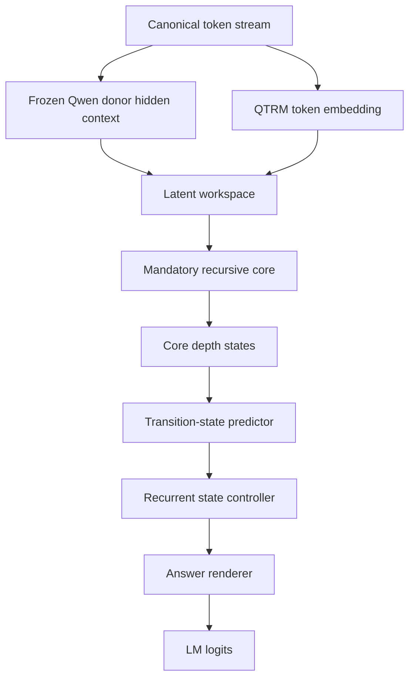

# Explicit Transition-State Core Next

Date: 2026-05-03

## Decision

The next canonical raw-intelligence candidate is an explicit recurrent
transition-state core, not another LeWM loss, answer-format fix, threshold, or
first-token-only CE variant.

## Why

The LeWM-free answer-state loop now has enough evidence:

```text
S160 rebuild:
  core is causal, but depth is behaviorally inert

semantic-depth S120:
  staged internal CE still leaves 16/16 heldout depth outputs identical

multi-token depth S080:
  first-token-only defect is removed, but core8 still loses to donor-only
  and list_transform remains 0/4
```

The failure is therefore not MemoryOS, retrieval, LeWM, answer formatting, or
only single-token supervision. The current model does not reliably form and use
intermediate state variables.

## Architecture Claim

```text
A smaller QTRM core can improve raw reasoning only if each recurrent step
updates an explicit, supervised state variable that is causally consumed by the
answer path.
```

## Proposed Path



Mermaid 8.8-safe text alternative:

```text
token stream
-> frozen donor hidden context
-> latent workspace
-> mandatory recursive core
-> core_depth_states
-> explicit transition_state_features
-> recurrent state controller
-> answer renderer
-> LM logits
```

## State Contract

For each depth step, the model must expose:

```text
core_depth_states[t]
transition_state_logits[t]
transition_state_features[t]
answer_logits_from_state[t]
```

The state is accepted only if:

```text
transition_state_features are supervised by symbolic state targets
state_off drops transition-state accuracy
state_off drops final-answer accuracy
core_off drops both
donor-only is beaten on heldout smoke before scale-up
```

## Reuse Existing Prior In Repo

The repo already has the narrow prior component:

```text
src/qtrm_mm/agentic/transition_controller.py
tests/test_transition_state_controller.py
scripts/158_train_transition_state_controller.py
scripts/159_eval_learned_state_answer_loop.py
```

Those components proved a narrow explicit transition-state controller can be
causal. The next step is to fold the same principle into the QTRM answer path,
not keep it as an external agentic sidecar.

## Minimal Experiment

1. Add an in-model transition-state predictor over `core_depth_states`.
2. Train it on `depth_targets` or structured state labels.
3. Feed the predicted transition-state features into the answer renderer.
4. Evaluate:

```text
donor_only
core_off
state_off
core_steps_1/2/4/8
```

## Acceptance Gate

```text
heldout smoke16:
  core8 > donor_only
  core8 > core1
  state_off drops below core8
  list_transform core8 > 0/4
  changed depth outputs >= 4/16

scale-up:
  same checks on 72 cases
```

## Implemented Surface

Implemented on 2026-05-04:

```text
model:
  QTRMConfig.transition_state_enabled
  QTRMConfig.transition_state_dim
  QTRMConfig.transition_state_hidden_dim
  QTRMConfig.transition_state_answer_gate_*

forward:
  transition_state_logits
  transition_state_features
  disable_transition_state=True ablation

answer path:
  core_depth_states
  -> TransitionStatePredictor
  -> transition_state_to_answer
  -> answer_state_loop logits

training/eval:
  canonical_causal_ablation_modes: [transition_state_off]
  scripts/196 --transition-state-contrast-weight
  scripts/192 mode: qtrm_core_steps_8_transition_state_off_no_evidence
  scripts/193 INCLUDE_TRANSITION_STATE_OFF=1
```

Candidate config:

```text
configs/qwen35_2b_4090_pure_recursive_transition_state_s080.yaml
```

Recommended first run:

```bash
CONFIG=configs/qwen35_2b_4090_pure_recursive_transition_state_s080.yaml \
INIT_CHECKPOINT=runs/qwen35_2b_4090_pure_recursive_answer_state_loop_causal_prefix_multitoken_s080/last.pt \
OUT_DIR=runs/qwen35_2b_4090_pure_recursive_transition_state_s080 \
RUN_NAME=pure_recursive_transition_state_s080 \
TRANSITION_STATE_CONTRAST_WEIGHT=0.5 \
TRANSITION_STATE_CONTRAST_MARGIN=0.05 \
CAUSAL_PREFIX_SUPERVISION=1 \
CAUSAL_PREFIX_MAX_TARGET_TOKENS=6 \
FAMILY_REPEAT=list_transform=4,arithmetic_chain=3,symbolic_binding=2 \
bash scripts/197_run_pure_recursive_depth_supervised_train.sh
```

The runner automatically sets `INCLUDE_TRANSITION_STATE_OFF=1` when
`TRANSITION_STATE_CONTRAST_WEIGHT` is non-zero. Manual state-off eval:

```bash
PYTHONPATH=src python scripts/192_eval_raw_intelligence.py \
  --config configs/qwen35_2b_4090_pure_recursive_transition_state_s080.yaml \
  --checkpoint runs/qwen35_2b_4090_pure_recursive_transition_state_s080/last.pt \
  --cases data/eval/pure_recursive_reasoning_heldout_72.jsonl \
  --max-cases 16 \
  --scoring causal_forced_choice \
  --mode donor_only_no_evidence \
  --mode qtrm_core_off_no_evidence \
  --mode qtrm_core_steps_1_no_evidence \
  --mode qtrm_core_steps_2_no_evidence \
  --mode qtrm_core_steps_4_no_evidence \
  --mode qtrm_core_steps_8_no_evidence \
  --mode qtrm_core_steps_8_transition_state_off_no_evidence \
  --out runs/eval/pure_recursive_transition_state_s080_depth_gate_16.jsonl
```

## Kill Criterion

If explicit transition-state supervision improves transition labels but does
not improve final answers under state-off/core-off ablations, the answer
renderer is the blocker and must be redesigned before any more core training.

## 2026-05-04 State-Machine Probe Update

The cleaner recurrent state-machine probe was implemented and tested:

```text
src/qtrm_mm/agentic/solver_state_machine.py
scripts/216_train_pure_recursive_solver_state_machine.py
```

Result:

```text
direct char recurrent state generation:
  train can improve
  heldout remains 0.0 even after larger data

operation primitive transition ceiling:
  heldout_large state 256/256
  heldout_large final 64/64

structured operation policy + primitive transition:
  heldout_large operation_exact 1.0
  heldout_large rollout_state_exact 1.0
  heldout_large rollout_final_exact 1.0
```

Updated decision:

```text
Do not train the recurrent core to directly emit arbitrary numeric/list state
strings as the canonical mechanism. Train the core to produce structured
transition metadata, choose or compose a causal primitive transition, update
explicit state, then render the answer.
```

Detailed report:

```text
docs/wiki/decisions/pure-recursive-solver-state-machine-probe-s240.md
```

## S080 Result

2026-05-04 run:

```text
checkpoint:
  runs/qwen35_2b_4090_pure_recursive_transition_state_s080/last.pt
summary:
  docs/wiki/decisions/pure-recursive-transition-state-s080-depth-gate-16-summary.json
status: rejected
donor_only: 5/16
core_off: 0/16
core8: 5/16
transition_state_off: 5/16
state-off output changes: 0/16
```

Conclusion:
The current transition-state branch is implemented and trainable, but it is
not yet answer-causal. Do not scale this S080 recipe as canonical. The next
candidate must strengthen the state-to-answer path or add direct symbolic
transition-state supervision before evaluating scale-up.

## Direct CE S080 Result

2026-05-04 follow-up run:

```text
checkpoint:
  /mnt/nvme1n1p2/qtrm-local-checkpoints/pure_recursive_transition_state_ce_s080/last.pt
eval jsonl:
  /mnt/nvme1n1p2/qtrm-eval/pure_recursive_transition_state_ce_s080_depth_gate_16.jsonl
summary:
  docs/wiki/decisions/pure-recursive-transition-state-ce-s080-depth-gate-16-summary.json
status: rejected
donor_only: 5/16
core_off: 0/16
core8: 5/16
transition_state_off: 5/16
depth outputs changed: 4/16
state-off output changes: 0/16
transition_state_first_token_acc during training: 0.0
```

This rejects the simplest direct-CE patch. The branch now exposes
`transition_state_text_logits`, but mapping a tiny sigmoid state vector directly
to the full Qwen vocabulary did not learn useful state readout in S080, and the
final answer remains unchanged when the state path is disabled.

## Big-Structure Doubt Gate

Root architecture claim:

```text
QTRM gains raw reasoning when recursive latent steps update explicit state that
is causally consumed before answer logits are emitted.
```

Falsifying observation:

```text
state_off == full on final answers, and core8 does not beat donor_only.
```

Current observation:

```text
full core8: 5/16
donor_only: 5/16
transition_state_off: 5/16
state-off output changes: 0/16
```

The required tensor path is:

```text
core_depth_states -> explicit_state -> answer hidden state -> LM logits
```

The current code has that path, but it is too weak: the explicit state is a
small continuous sigmoid vector added as a gated residual, while the answer
renderer can still rely on the ordinary trajectory cross-attention path. This
means more CE/contrast weight is unlikely to prove the architecture. The next
candidate should make the state representation discrete or token-like and make
the answer path consume that state as a mandatory causal input.

## Next Candidate

Preferred next falsifiable experiment:

```text
state-code token path
  core_depth_states
  -> compact supervised state-code classifier
  -> learned state-code embedding
  -> answer_state_loop as mandatory state token/query
  -> LM logits
```

Acceptance gate:

```text
heldout smoke16:
  state_code_acc > 0.8 on labelled internal states
  core8 > donor_only
  core8 > transition_state_off
  state-off output changes > 0/16
  list_transform core8 > 0/4
```

Kill criterion:

```text
If state-code accuracy improves but final-answer state-off ablation is still
identical, the answer-state loop itself must be replaced by a stricter
state-token decoder rather than patched with another side loss.
```

## State-Code S080 Result

2026-05-04 run:

```text
config:
  configs/qwen35_2b_4090_pure_recursive_transition_state_code_s080.yaml
checkpoint:
  /mnt/nvme1n1p2/qtrm-local-checkpoints/pure_recursive_transition_state_code_s080/last.pt
eval jsonl:
  /mnt/nvme1n1p2/qtrm-eval/pure_recursive_transition_state_code_s080_depth_gate_16.jsonl
summary:
  docs/wiki/decisions/pure-recursive-transition-state-code-s080-depth-gate-16-summary.json
status: rejected
donor_only: 5/16
core_off: 0/16
core1/core2/core4/core8: 4/16, 5/16, 5/16, 5/16
transition_state_off: 5/16
depth outputs changed: 4/16
state-off output changes: 0/16
```

Training signal:

```text
early easy cases:
  transition_state_code_ce dropped from 6.48 to near 0
  transition_state_code_acc reached 1.0

later hard cases:
  transition_state_code_ce spiked again
  transition_state_code_acc fell to 0.0 on some logged windows
```

Interpretation:
The compact state-code surface is easier to learn than full-vocab
transition-state CE, but it still does not become final-answer causal. The
state-off ablation produces identical completions on the 16-case gate. This
hits the kill criterion above: the answer-state loop is the active blocker.

Next architecture direction:

```text
Do not add another side CE to the same answer_state_loop.
Replace the renderer with a stricter state-token decoder where the final logits
are computed from the recurrent state token itself, or run an overfit-8 proof
that removes the ordinary trajectory cross-attention bypass.
```

## Code-Only State Decoder S080 Result

2026-05-04 run:

```text
config:
  configs/qwen35_2b_4090_pure_recursive_transition_state_code_only_s080.yaml
checkpoint:
  /mnt/nvme1n1p2/qtrm-local-checkpoints/pure_recursive_transition_state_code_only_s080/last.pt
eval jsonl:
  /mnt/nvme1n1p2/qtrm-eval/pure_recursive_transition_state_code_only_s080_depth_gate_16.jsonl
summary:
  docs/wiki/decisions/pure-recursive-transition-state-code-only-s080-depth-gate-16-summary.json
status: rejected
donor_only: 5/16
core_off: 0/16
core1/core2/core4/core8: 4/16, 4/16, 4/16, 5/16
transition_state_off: 3/16
state-off output changes: 6/16
```

This is rejected because core8 still ties donor-only, but it is the first
transition-state candidate where the state path is held-out answer-causal:

```text
passed:
  deep_core_beats_core_off
  deep_core_beats_transition_state_off
  depth_scaling_gain_present
  no_retrieval_or_memoryos_shortcut

failed:
  deep_core_does_not_beat_donor
```

Interpretation:
The ordinary answer-state loop had a trajectory cross-attention bypass. Removing
that bypass and forcing answer logits through the compact state-code token made
`transition_state_off` matter. This validates the direction:

```text
strict state-token decoder > side state readout
```

Remaining blocker:

```text
The state-token decoder is causal but undertrained/underexpressive. It preserves
the old 5/16 core8 score rather than improving beyond donor-only, and it still
fails list_transform and symbolic_binding.
```

Next experiment:

```text
code-only S240/S500 with:
  higher or scheduled code CE on hard families
  all-depth CE enabled lightly
  family-balanced hard negatives
  acceptance: core8 > donor_only and transition_state_off remains below core8
```

## Code-Only State Decoder S240 Result

2026-05-04 run:

```text
config:
  configs/qwen35_2b_4090_pure_recursive_transition_state_code_only_s080.yaml
init:
  /mnt/nvme1n1p2/qtrm-local-checkpoints/pure_recursive_transition_state_code_only_s080/last.pt
checkpoint:
  /mnt/nvme1n1p2/qtrm-local-checkpoints/pure_recursive_transition_state_code_only_s240/last.pt
eval jsonl:
  /mnt/nvme1n1p2/qtrm-eval/pure_recursive_transition_state_code_only_s240_depth_gate_16.jsonl
summary:
  docs/wiki/decisions/pure-recursive-transition-state-code-only-s240-depth-gate-16-summary.json
status: rejected
donor_only: 5/16
core_off: 0/16
core1/core2/core4/core8: 3/16, 3/16, 4/16, 4/16
transition_state_off: 3/16
state-off output changes: 4/16
```

Mode semantics:

```text
donor_only:
  true donor baseline; QTRM residual logits are forced off and donor logits are used.
core_off:
  internal QTRM ablation; QTRM forward still runs with disable_core=True and
  donor fallback is not forced. It is not equivalent to donor_only.
transition_state_off:
  QTRM core still runs, but the explicit transition-state/code path is disabled.
```

Checks:

```text
passed:
  deep_core_beats_core_off
  deep_core_beats_transition_state_off
  depth_scaling_gain_present
  depth_outputs_not_all_identical
  no_retrieval_or_memoryos_shortcut

failed:
  deep_core_does_not_beat_donor
```

Family result:

```text
arithmetic_chain:
  donor 2/4, core8 1/4, transition_state_off 0/4
boolean_logic:
  donor 2/4, core8 2/4, transition_state_off 2/4
list_transform:
  donor 0/4, core8 0/4, transition_state_off 0/4
symbolic_binding:
  donor 1/4, core8 1/4, transition_state_off 1/4
```

Interpretation:
S240 keeps the causal state path but does not improve capability. Compared with
S080, core8 falls from `5/16` to `4/16`, while donor remains `5/16`. The
transition-state-off ablation still drops below core8 (`3/16`) and changes
outputs on `4/16` cases, so the state-code token remains on the answer path.
However, list_transform remains `0/4`, and arithmetic_chain is still below
donor. This falsifies the idea that simply extending the same objective is
enough.

Updated architecture decision:

```text
canonical causal checkpoint:
  pure_recursive_transition_state_code_only_s080

rejected extension:
  pure_recursive_transition_state_code_only_s240

do next:
  hard-family curriculum before longer runs
  explicit overfit-8 proof for list_transform/arithmetic_chain
  inspect whether state-code labels collapse or conflict on hard families

do not do next:
  blind S500 with the same sampling/objective
  answer-format tuning
  MemoryOS/RAG support metrics as substitutes for raw reasoning
```

## Hard-Family Overfit8 S120 Result

2026-05-04 follow-up from the canonical code-only S080 checkpoint:

```text
config:
  configs/qwen35_2b_4090_pure_recursive_transition_state_code_only_s080.yaml
init:
  /mnt/nvme1n1p2/qtrm-local-checkpoints/pure_recursive_transition_state_code_only_s080/last.pt
checkpoint:
  /mnt/nvme1n1p2/qtrm-local-checkpoints/pure_recursive_hard_family_overfit8_s120/last.pt
families:
  arithmetic_chain,list_transform
cases:
  start_index=100, cases_per_family=4
```

Legacy summed-logprob eval was rejected:

```text
summary:
  docs/wiki/decisions/pure-recursive-hard-family-overfit8-s120-depth-gate-8-summary.json
status: rejected
donor_only: 1/8
core8: 1/8
transition_state_off: 0/8
list_transform: 0/4
```

Root cause found:
the eval ranked candidates by raw summed answer-token logprob. That gave a
structural advantage to one-token distractors like `EMPTY` over multi-token
answers like `208,204`. This is a scoring contract defect for variable-length
forced-choice gates.

Canonical corrected eval:

```text
scoring:
  causal_forced_choice
choice_score_normalization:
  mean
eval:
  /mnt/nvme1n1p2/qtrm-eval/pure_recursive_hard_family_overfit8_s120_mean_depth_gate_8.jsonl
summary:
  docs/wiki/decisions/pure-recursive-hard-family-overfit8-s120-mean-depth-gate-8-summary.json
status: accepted
donor_only: 1/8
core_off: 0/8
core1/core2/core4/core8: 2/8, 3/8, 3/8, 3/8
transition_state_off: 0/8
list_transform core8: 2/4
depth changed: 2/8
shortcuts: 0
```

Decision:
The strict code-only transition-state path has now passed the smallest local
hard-family overfit proof under a corrected eval contract. This is the first
clean local signal where recursive depth, not MemoryOS/RAG or answer formatting,
beats donor-only and state-off on the hard families. It is still not a held-out
generalization proof.

Next:

```text
freeze eval contract:
  causal_forced_choice + mean choice-score normalization

run heldout hard-family gate:
  same checkpoint first
  different start_index
  then train with train_start != heldout_start

accept only if:
  core8 > donor_only
  core8 > transition_state_off
  list_transform core8 > donor list_transform
  depth change remains non-zero
```

## Heldout200 Check After Overfit8

Same S120 checkpoint, corrected mean-normalized gate, different hard-family
indices:

```text
heldout_start_index:
  200
eval:
  /mnt/nvme1n1p2/qtrm-eval/pure_recursive_hard_family_overfit8_s120_heldout200_mean_depth_gate_8.jsonl
summary:
  docs/wiki/decisions/pure-recursive-hard-family-overfit8-s120-heldout200-mean-depth-gate-8-summary.json
status:
  rejected
donor_only:
  2/8
core8:
  1/8
transition_state_off:
  0/8
list_transform core8:
  0/4
```

Interpretation:
The strict state-code path is causal and can overfit the local hard slice, but
it has not learned the abstract arithmetic/list operations. On heldout200,
list_transform predictions stay near the train100 numeric range (`204,202`)
when the correct doubled values are around `408,404`.

Architecture implication:

```text
Do not add MemoryOS/RAG or answer-format fixes.
Do not claim ASI/general raw intelligence from the overfit8 acceptance.
Do broaden the pure recursive training distribution and keep transition_state_off
in every gate.
```

Next experiment:

```text
hard-family generalization S240:
  train families: arithmetic_chain,list_transform
  train cases per family: 16 or more
  train start index: 100
  heldout cases per family: 4
  heldout start index: 200
  eval contract: causal_forced_choice + mean choice-score normalization
```

## Hard-Family Generalization S240 Result

The broader S240 run did not establish held-out raw-recursive gain:

```text
runner:
  scripts/211_run_pure_recursive_hard_family_generalization_s240.sh
checkpoint:
  /mnt/nvme1n1p2/qtrm-local-checkpoints/pure_recursive_hard_family_generalization_s240/last.pt
summary:
  docs/wiki/decisions/pure-recursive-hard-family-generalization-s240-depth-gate-8-summary.json
status:
  rejected
donor_only:
  2/8
core8:
  2/8
transition_state_off:
  0/8
list_transform core8:
  0/4
```

The run proves only this:

```text
core8 > core_off
core8 > transition_state_off
core8 == donor_only
```

So the transition-state path remains answer-causal, but it does not yet beat
the simpler donor baseline on held-out hard-family reasoning.

Failure ledger:

```text
Failure:
  list_transform does not generalize beyond the numeric training range.
Evidence:
  heldout200 expects doubled values around 408/404, while core8 often selects
  half-scale or train-range-like outputs such as 204/202.
Known limitation class:
  raw recursive reasoning failure; causal state path without semantic state.
Root architecture hypothesis:
  first-token-id modulo codebook is not a semantic transition-state target.
Could the big structure be wrong?:
  The mandatory core path is plausible, but the state objective is too weak.
Information path needed:
  prompt tokens -> recurrent core -> semantic stage/state -> answer logits.
Current information path:
  prompt tokens -> recurrent core -> token-id hash code -> answer logits.
Local fix budget already spent:
  overfit8 S120 and broader S240.
Likely component:
  transition_state_code_targets and preference margin contract.
Alternative explanations:
  training steps may still be low, but the heldout failure shape is systematic.
Architecture candidates:
  1. semantic transition-state code targets plus sequence preference margin
  2. full text transition-state decoder with staged intermediate strings
  3. numeric/vector state regression for generated arithmetic/list states
Recommended candidate:
  semantic transition-state code targets plus sequence preference margin.
Smallest next experiment:
  scripts/212_run_pure_recursive_semantic_state_sequence_margin_s240.sh
Acceptance gate:
  core8 > donor_only and core8 > transition_state_off on heldout200.
Kill criterion:
  if list_transform remains 0/4, move to explicit text/numeric state targets.
Wiki target:
  pure-recursive-semantic-state-sequence-margin-s240-depth-gate-8.
```

Implemented next:

```text
cases now emit transition_state_codes
preferences preserve transition_state_codes
training prioritizes explicit transition_state_codes before token-id hash fallback
training supports --choice-margin-mode sequence
runner added:
  scripts/212_run_pure_recursive_semantic_state_sequence_margin_s240.sh
```

## Semantic State + Sequence Margin S240 Result

The semantic-code experiment also failed the heldout gate:

```text
checkpoint:
  /mnt/nvme1n1p2/qtrm-local-checkpoints/pure_recursive_semantic_state_sequence_margin_s240/last.pt
summary:
  docs/wiki/decisions/pure-recursive-semantic-state-sequence-margin-s240-depth-gate-8-summary.json
status:
  rejected
donor_only:
  2/8
core8:
  1/8
transition_state_off:
  0/8
list_transform core8:
  0/4
```

Updated conclusion:

```text
The categorical state-code path is too low-bandwidth for value-bearing
reasoning. It can say which stage the core is in, but it cannot carry the
intermediate values that list_transform and arithmetic need.
```

Failure examples:

```text
list-transform-200:
  expected: 408,404
  core8:    204,202

list-transform-201:
  expected: 404,416,408
  core8:    202,208,204
```

Root-architecture decision:

```text
Stop spending local fixes on categorical code-only transition state.
Next candidate must be value-bearing:
  continuous transition_state_features, or
  explicit text/numeric state targets consumed by the answer loop.
```

Next runner:

```text
scripts/213_run_pure_recursive_value_state_sequence_margin_s240.sh

change:
  use configs/qwen35_2b_4090_pure_recursive_transition_state_s080.yaml
  enable continuous transition_state_features instead of code-only state
  train transition_state_text_logits on staged first-token targets
  keep sequence preference margin aligned with mean forced-choice eval

accept:
  core8 > donor_only on heldout200
  core8 > transition_state_off
  list_transform core8 > 0/4

kill:
  if list_transform still outputs filtered half-scale values, move to explicit
  full-sequence text/numeric transition-state supervision.
```

## Continuous Value-State S240 Result

The continuous transition-state experiment also failed the donor comparison:

```text
checkpoint:
  /mnt/nvme1n1p2/qtrm-local-checkpoints/pure_recursive_value_state_sequence_margin_s240/last.pt
summary:
  docs/wiki/decisions/pure-recursive-value-state-sequence-margin-s240-depth-gate-8-summary.json
status:
  rejected
donor_only:
  2/8
core8:
  2/8
transition_state_off:
  1/8
list_transform core8:
  0/4
```

What survived:

```text
core8 > core_off
core8 > transition_state_off
depth outputs are not all identical
```

What failed:

```text
core8 == donor_only
list_transform remains 0/4
state first-token supervision stayed at 0 accuracy during training
```

Failure ledger update:

```text
Failure:
  continuous state path is weakly causal but not value-bearing enough.
Evidence:
  core8 beats transition_state_off by only 1 hit and ties donor-only; list
  transform still outputs filtered/half-scale values such as 204,202 instead
  of doubled heldout values like 408,404.
Known limitation class:
  raw recursive reasoning failure; transition state lacks full intermediate
  value content.
Could the big structure be wrong?:
  Mandatory recursive core remains plausible, but the current state-readout
  contract is wrong. It asks a latent vector to help answer without requiring
  the vector to reconstruct or preserve the full intermediate state.
Information path needed:
  prompt tokens -> recurrent core -> full intermediate value state -> next
  recurrent step/readout -> answer logits.
Current information path:
  prompt tokens -> recurrent core -> continuous state features with first-token
  staged supervision -> answer logits.
Local fix budget already spent:
  token-hash code, semantic categorical code, continuous first-token state.
Recommended candidate:
  explicit full-sequence text/numeric transition-state supervision, with a
  gate that proves the state path is necessary and beats donor on heldout.
Smallest next experiment:
  add full-state token supervision for staged intermediate targets and run the
  same heldout200 mean forced-choice gate.
Kill criterion:
  if full-state supervision still leaves list_transform at 0/4 or ties donor,
  stop adapting this donor-residual path and move to a cleaner recurrent
  state-machine core trained from solver traces.
```

## Full-State Sequence Supervision Candidate

Implemented the smallest KISS architecture change after three failed local
state objectives:

```text
script:
  scripts/196_train_pure_recursive_depth_supervised.py

new objective:
  staged_internal_sequence_ce_loss

new CLI:
  --staged-internal-sequence-ce-weight
  --staged-internal-sequence-max-target-tokens

runner:
  scripts/214_run_pure_recursive_full_state_sequence_s240.sh
```

Contract:

```text
depth 1 readout must match depth_targets["1"] token sequence
depth 2 readout must match depth_targets["2"] token sequence
depth 4 readout must match depth_targets["4"] token sequence
depth 8 readout must match depth_targets["8"] token sequence
```

Why this is the next candidate:

```text
Categorical codes:
  causal but too low-bandwidth.
Continuous first-token state:
  weakly causal but did not learn full values.
Full-state sequence readout:
  directly penalizes wrong intermediate values such as filtered-only
  list_transform outputs.
```

Acceptance remains unchanged:

```text
core8 > donor_only
core8 > transition_state_off
list_transform core8 > 0/4
no retrieval, no MemoryOS, no hidden evidence
```

## Full-State Sequence S240 Result

The full-state sequence readout experiment was rejected:

```text
checkpoint:
  /mnt/nvme1n1p2/qtrm-local-checkpoints/pure_recursive_full_state_sequence_s240/last.pt
summary:
  docs/wiki/decisions/pure-recursive-full-state-sequence-s240-depth-gate-8-summary.json
status:
  rejected
donor_only:
  2/8
core8:
  2/8
transition_state_off:
  2/8
list_transform core8:
  0/4
```

The decisive failure:

```text
core8 == donor_only
core8 == transition_state_off
```

Examples stayed unchanged:

```text
list-transform-200:
  expected: 408,404
  core8:    204,202

list-transform-201:
  expected: 404,416,408
  core8:    202,208,204
```

Root-architecture conclusion:

```text
Do not add another local loss to this donor-residual/readout path.
The state path is not robustly causal for value-bearing reasoning.
The next model candidate must make state transition itself the primary model:
  explicit recurrent state-machine core
  solver-trace state targets
  separate state-prediction gate
  separate answer-readout gate
```

Replacement candidate:

```text
Prompt encoder -> recurrent state core -> state decoder -> answer decoder

Training:
  state[t] predicts solver_trace[t]
  state[t+1] is conditioned on state[t], operation, and prompt summary
  answer is read only from the final state

Gate:
  state prediction accuracy by depth
  final answer accuracy
  core_steps 1/2/4/8 scaling
  donor-only and core-off baselines
```

Trace-data foundation implemented:

```text
cases now include:
  solver_trace:
    depth
    operation
    state_text

flattening script:
  scripts/215_build_pure_recursive_solver_trace_dataset.py

generated train trace:
  data/filtered/pure_recursive_solver_trace_train.jsonl

generated heldout trace:
  data/eval/pure_recursive_solver_trace_heldout200.jsonl
```

This does not yet improve model score. It makes the next architecture
falsifiable: if a recurrent state-machine cannot predict `target_state_text`
from prompt, previous state, and operation on heldout traces, answer-level
training should not be trusted.
